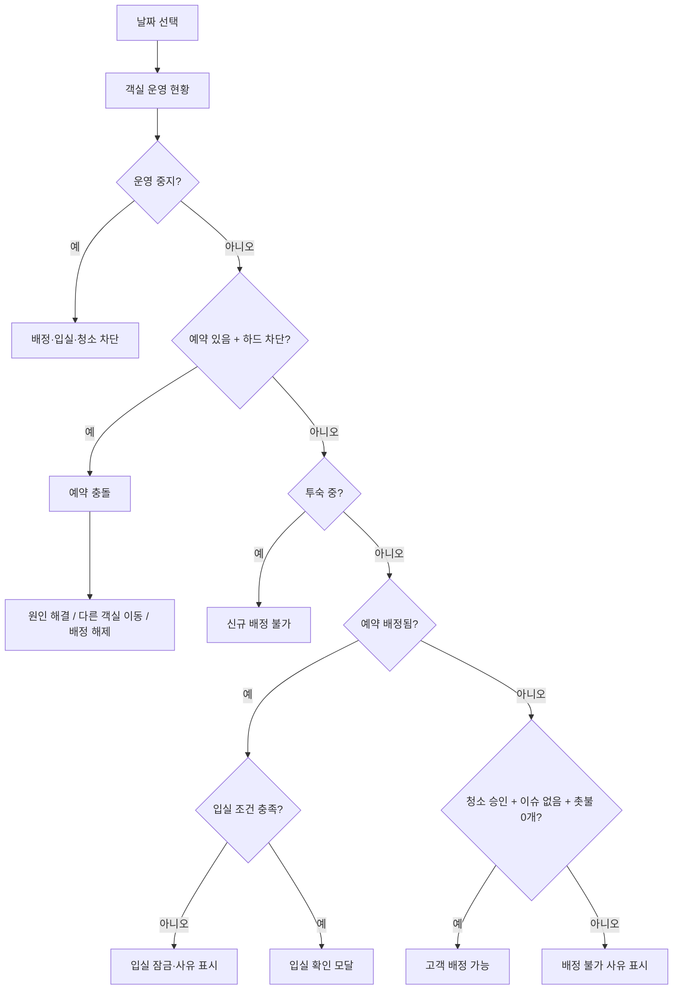
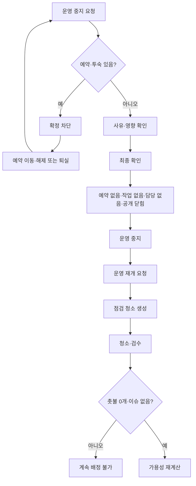
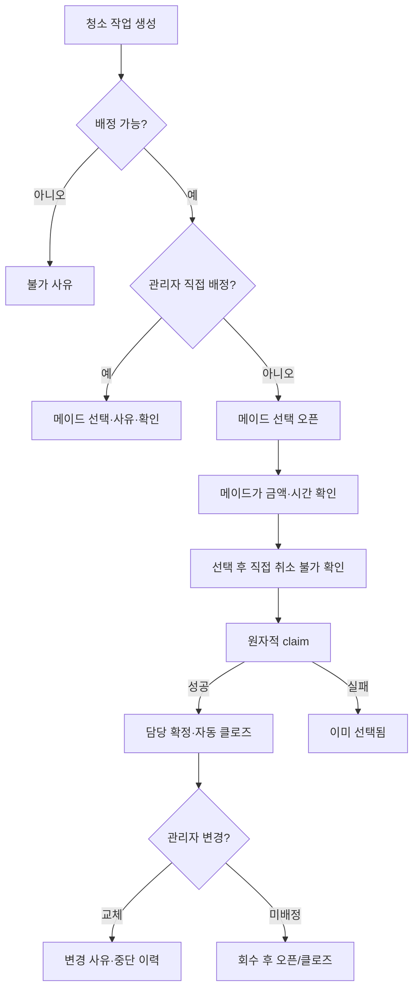
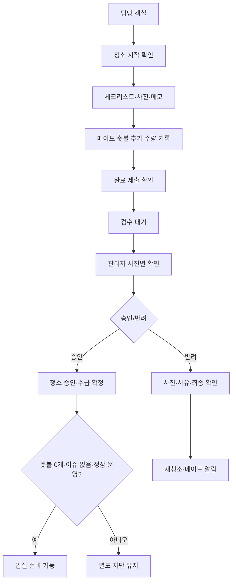
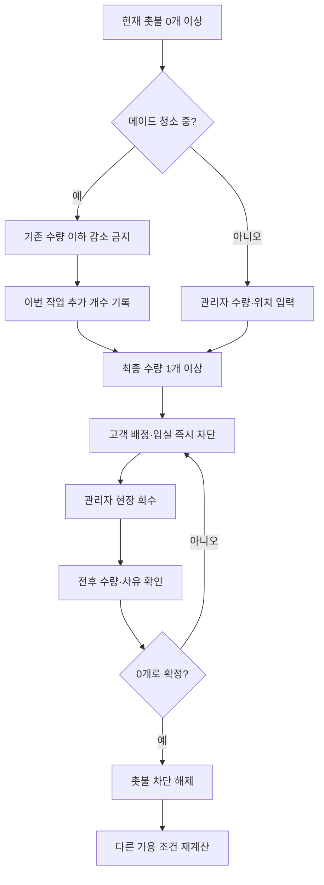
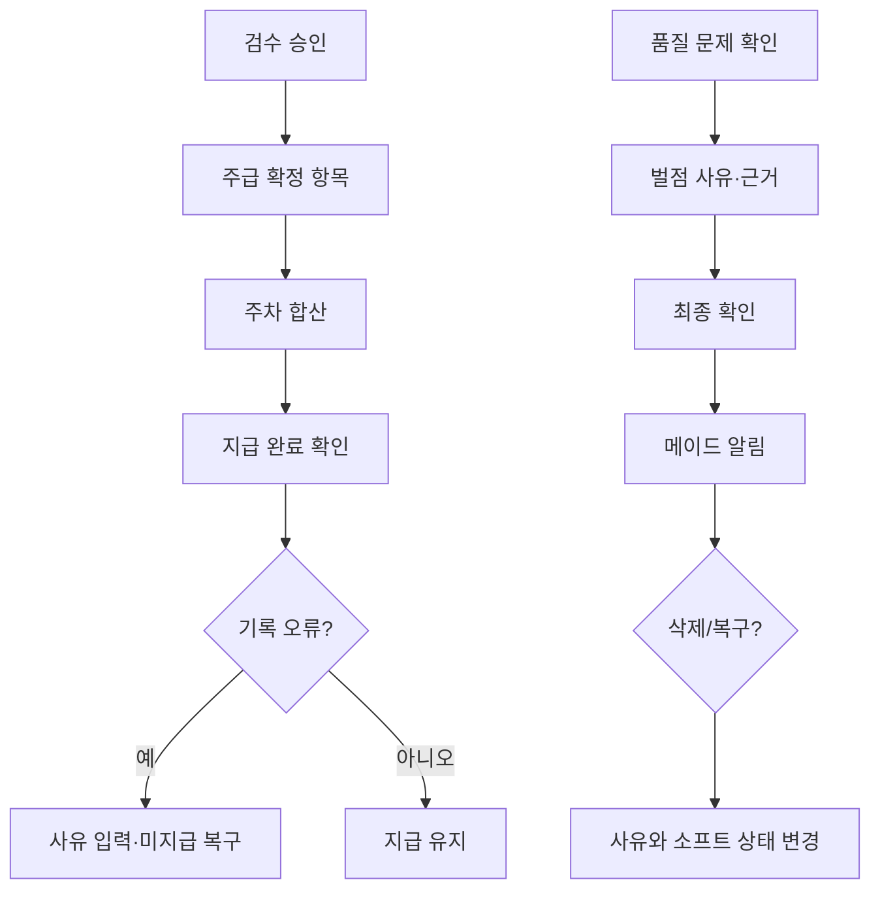
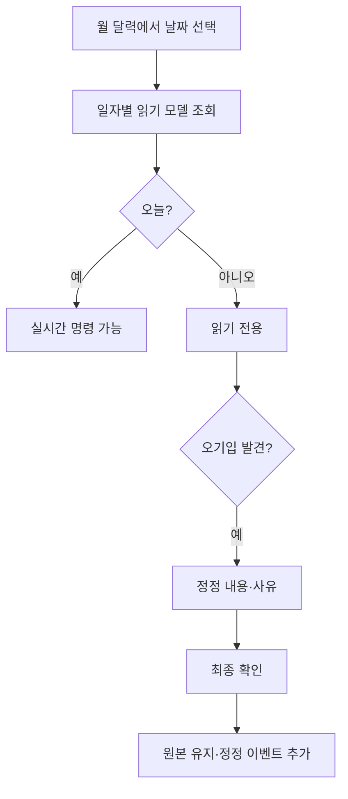

# 4. 주요 업무 흐름과 플로우차트

렌더링된 PNG·SVG와 Graphviz 원본은 `FLOWCHARTS/`에 있다.

## 4.1 객실 운영·고객 배정

## 4.2 608호 운영 중지·재개

## 4.3 청소 일감·담당

## 4.4 청소·사진·검수

## 4.5 촛불 배치·회수

## 4.6 주급·벌점

## 4.7 일자별 이력·정정

