# 캐슬디아트 객실관리 앱 UX·기능 감사 및 재설계 기준

- 작성일: 2026-08-14
- 대상: `D:\room-management-system` v13 인수인계 패키지
- 상태: UX·기능 감사 최종안 v1.1 — 운영 답변 및 2차 독립 감사 반영 완료
- 원칙: 현재 HTML은 시각 참고만 유지하고, 제품 구조와 업무 흐름은 새로 설계한다.

## 1. 감사 결론

현재 v13은 클릭형 와이어프레임으로는 상호작용이 많지만 실제 운영 기준으로는 **재설계가 필요하다**. 객실 상태와 메이드 관리보다 특정 608호, 촛불, 예약 이동, 사진별 검수 절차가 과도하게 중심에 놓여 있다.

유지할 방향:

- 관리자가 단가·가능 시각·마감이 있는 청소 일감을 공개한다.
- 메이드가 공개 일감을 선착순으로 선택한다.
- 담당 객실에서만 객실 PIN을 확인한다.
- 청소 완료 후 사진·체크리스트·특이사항을 제출한다.
- 관리자가 승인하거나 반려한다.
- 승인된 청소 단가가 주급에 적립된다.
- 촛불이 1개 이상이면 고객 입실을 차단한다.

다시 설계할 부분:

- 수동 예약 표시와 고객 입실 가능 상태를 분리한다.
- 예정 체크아웃 시각에 예약 점유를 자동 종료하고 청소 출입을 연다. 현장 벨 확인은 앱 입력 절차로 강제하지 않는다.
- 예약 저장 시 비공개 퇴실 청소 초안을 자동 생성하되 일감 공개는 관리자가 통제한다.
- 색상은 저장하지 않고 실제 상태에서 계산한다.
- 시간 우선순위를 고정 색상이 아니라 남은 여유시간으로 계산한다.
- 사진별 확인 강제를 없애고 청소 제출 전체를 승인·반려한다.
- 객실 PIN을 목록에 평문으로 노출하지 않는다.
- 608호 전용 규칙은 제거하고 일반적인 운영 중지 규칙으로 바꾼다.
- CSV/PMS/OTA와 예약 이동 기능은 MVP에서 제외한다.
- 객실·메이드 이력은 날짜별로 재현하고 현재 담당자가 과거 수행자를 덮어쓰지 않게 한다.
- 비활성·퇴사 인계, 사진·개인정보 보존 만료, 오프라인 충돌까지 운영 흐름에 포함한다.

## 2. UX 기준 기능 지도

### 관리자 — 객실 상태 관리

1. 오늘 조치 큐
   - 입실 시각 도달·미준비
   - 시작 가능 시각이 지난 미선점 청소
   - 마감 위험 청소
   - 검수 대기
   - 촛불·입실 차단 특이사항
2. 객실 일별 현황 — `객실` 탭 기본 화면
   - 빨강·주황·초록·중립색 상태
   - 오늘 기본·이전/다음 날짜·날짜 직접 선택
   - 과거 일마감 상태와 당일 이벤트·미래 예약 및 작업 예정
   - 객실 타입·번호·날짜·담당 메이드 필터
   - 다음 체크인·체크아웃과 남은 시간
3. 수동 예약
   - 입·퇴실 날짜와 예정 시각
   - 기본 체크인 16:00·체크아웃 11:00 자동 입력
   - 고객 이름 선택 입력
   - 얼리 체크인·레이트 체크아웃 1시간 단위 조정
   - 객실별 기간 중복 차단
   - 저장 시 예정 체크아웃 연결 퇴실 청소 비공개 초안 자동 생성
4. 청소 작업
   - 객실 타입별 고정 단가·예상시간 설정과 작업 자동 입력
   - 공개 대기 작업 모음·일괄 공개
   - 예정 체크아웃 시각 예약 종료·청소 출입 자동 개방
   - 마감·긴급 지정·긴급 직접 배정
   - 담당 취소 승인·재공개
   - 타입·청소 유형별 체크리스트·사진 템플릿 설정
5. 객실 안전·정보
   - 운영 중지·재개
   - 특이사항 등록·해결
   - 촛불 증감·회수
   - 객실 PIN 변경·마스킹 조회
   - 변경 이력

### 관리자 — 메이드 관리

1. 계정·근무 상태
   - 관리자·메이드 계정 생성
   - 동명이인 번호·최초 로그인 비밀번호·로그인 비밀번호 초기화
   - 활동·비활성·퇴사·복구
   - 비활성·퇴사 시 담당 인계·정상 완료 건 24시간 제출·중단 건 증빙 업로드
2. 오늘 업무 현황
   - 선점 객실 수
   - 현재 청소 중인 한 객실
   - 마감 위험과 취소 요청
   - 날짜·기간별 담당 객실과 실제 청소 완료 이력
3. 검수
   - 제출 전체 승인·반려
   - 기존 담당 재청소·예외 재공개
4. 주급
   - 이번 주 적립
   - 지난주 지급 대상
   - 다음 월요일 외부 지급·완료 기록
   - 지급 정정·상계 이력
5. 평가
   - 컴플레인·벌점·반려 이력
   - 주급 자동 차감 없음

### 메이드 앱

1. 로그인: 이름 아이디·최초 로그인 비밀번호 변경·개인 세션
2. 공개 일감: 일괄 공개된 작업의 계획 서비스일·단가·유형별 출입 일정·가능 시각·마감·예상시간 확인 후 선착순 선택
3. 내 업무: 여러 작업 선점, 동시에 한 객실만 청소 진행
4. 청소 수행: 객실 PIN 확인, 유형별 체크리스트·필수/선택 사진·특이사항·촛불 기록
5. 완료·검수: 승인·반려·재청소 알림
6. 주급·평가: 예상·확정·지급과 본인 컴플레인·벌점 확인

### 공통 기반

- 개인 로그인과 역할별 권한
- 서버 원자적 담당·시작·검수·지급 전이
- PWA 푸시와 앱 내부 알림함
- 사진 오프라인 임시저장·재전송
- 감사 로그와 상태 변경 이력
- 날짜별 객실 상태 재현과 청소 수행 회차 원장
- 개인정보 익명화·사진과 파생 파일 보존 만료
- 서버 시각·중복 요청 방지

### KEEPER 참고 범위

[KEEPER 서비스 소개](https://11c.kr/service)에서 확인되는 `현장용 앱/관리자용 화면 분리`, `오늘 할 일·진행률·이슈 실시간 모니터링`, `완료한 업무 횟수 기준 정산`은 캐슬디아트의 역할별 IA와 승인 청소 단가 원장에 참고한다. 반면 PMS 연동·시설 정비·구매 대행 등 넓은 플랫폼 범위는 MVP에 가져오지 않는다. 소개 페이지에 나오지 않는 선착순 선택·객실 PIN 공개·검수 상세는 KEEPER를 추정하지 않고 캐슬디아트에서 확정한 운영정책만 사용한다.

### 현재 기능 처리 결정

| 현재 요소 | 결정 | 재설계 이유 |
|---|---|---|
| 공개 일감·메이드 선착순 선택 | 유지 | 실제 운영정책으로 확인됨 |
| 관리자 직접 배정 | 예외 기능으로 유지 | 긴급·재공개·취소 승인 시 필요 |
| 네 개의 중복 객실 요약 목록 | 교체 | 한 객실이 여러 목록에 반복돼 조치 우선순위가 흐려짐 |
| 촛불 전용 홈 목록 | 필터로 축소 | 입실 차단 사유 중 하나로 객실 큐에 통합 |
| 예약 배정·이동·해제 | MVP 제거 | 외부 어드민과 별도이며 앱은 수동 예약 표시에 집중 |
| 예약+촛불=`예약 충돌` | 명칭·로직 교체 | 예약은 유지하고 고객 입실만 차단해야 함 |
| 사진별 확인 완료 | 제거 | 확정 요구는 청소 제출 전체 승인·반려 |
| 608호 전용 플로우 | 제거 | 특정 데모 객실을 제품 규칙으로 만들면 안 됨 |
| 확인 모달 20여 종 | 축소 | 금전·보안·입실 영향·삭제성 행동에만 사용 |
| 벌점의 주급 자동 연결 | 금지 | 평가 참고용으로만 사용 |
| CSV/PMS/OTA | 후속 범위 | 수동 예약 MVP 안정화 이후 검토 |

## 3. 확정된 운영정책

### 제품 중심축

1. 관리자 객실 상태 관리
2. 관리자 메이드 관리

### 객실 타입

1. 스탠다드 더블 로프트
2. 프리미엄 더블 로프트
3. 파셜 오션뷰 프리미엄 더블 로프트
4. 파셜 오션뷰 패밀리 투룸 로프트

호실과 타입의 실제 매핑은 추후 입력한다.

### 계정·권한

- 기존 관리자가 관리자·메이드 계정을 생성한다.
- 로그인 아이디와 표시 이름은 등록 이름을 사용한다.
- 동명이인이 있으면 두 계정 모두 `김민지1`, `김민지2`처럼 번호를 붙여 표시 이름과 로그인 아이디를 동일하게 구분한다.
- 두 번째 동명이인 등록으로 기존 아이디가 `김민지`에서 `김민지1`로 바뀌어도 기존 사용자의 개인 로그인 비밀번호·이력과 현재 세션은 새 아이디 최초 로그인 전까지 유지한다. 아이디 변경 사실은 로그인 전에도 알 수 있는 별도 안내가 필요하다.
- 바뀌기 전 아이디 `김민지`는 기존 사용자가 새 아이디 `김민지1`로 한 번 성공적으로 로그인할 때까지 해당 계정의 임시 로그인 별칭으로만 유지한다. 별칭으로 로그인하면 새 아이디를 계속 안내하며, 새 아이디 로그인 성공 즉시 별칭을 폐기한다.
- 새 아이디 최초 성공 로그인 시 그 로그인에 사용한 현재 기기 세션만 유지하고, 기존 아이디로 인증된 다른 기기 세션은 모두 폐기한다.
- 임시 별칭은 별도 사용자 계정이 아니라 같은 불변 사용자 ID를 가리키는 인증용 레코드다. 담당·제출·평가·주급은 로그인 아이디가 아니라 불변 사용자 ID에만 연결하며, 새 아이디 최초 성공 로그인과 별칭 폐기는 한 번의 원자 작업으로 처리한다.
- 한번 부여한 동명이인 번호는 퇴사·비활성 이후에도 재사용하거나 당겨 붙이지 않는다.
- 계정 저장 전 휴대폰 번호를 정규화해 전체 번호 중복을 확인한다. 같은 번호의 활성 계정이 있으면 신규 생성을 막고, 비활성·퇴사 계정이면 새 계정을 만들지 않고 기존 계정 복구 흐름으로 보낸다.
- 복구 시 기존 아이디·동명이인 번호·청소·주급·평가 이력을 유지하고, 관리자가 새 휴대폰 번호와 역할·근무 상태를 확인한 뒤 활성화한다.
- 관리자·메이드의 최초 로그인 비밀번호는 등록된 휴대폰 번호의 마지막 4자리로 한다.
- 최초 로그인 시 개인 로그인 비밀번호 변경을 강제한다.
- 개인 로그인 비밀번호는 숫자 6자리 이상으로 설정한다.
- 로그인에 연속 5회 실패하면 서버에서 해당 계정을 15분 잠그고 남은 시간을 표시한다. 성공 로그인 또는 관리자의 감사 가능한 로그인 비밀번호 초기화 후에는 실패 횟수와 잠금을 함께 초기화한다.
- 로그인 비밀번호를 잊으면 관리자가 휴대폰 뒷 4자리로 초기화하고 기존 세션을 폐기하며 다음 로그인에서 다시 변경을 강제한다.
- 여러 관리자 계정을 허용하고 MVP에서는 모두 같은 관리 권한을 가진다.
- 검수·객실 타입 단가 설정 변경·객실 PIN 변경·지급 완료 등 관리자 행동은 수행자와 시각을 이력으로 남긴다.

보안 감사상 휴대폰 뒷 4자리는 추측하기 쉬우므로 최초 발급·관리자 초기화에만 사용한다. 로그인 실패 제한, 강제 변경 전 민감정보 접근 차단, 비활성 계정 세션 폐기를 함께 적용한다.

화면과 API에서 개인 계정용은 `로그인 비밀번호`, 객실 출입용 4자리는 `객실 PIN`으로 명칭을 완전히 분리한다. 로그인 비밀번호는 선행 0을 보존하는 숫자 문자열로 검증하고 강한 단방향 해시만 저장하며 로그·알림·감사 이벤트에는 값을 남기지 않는다. 동명이인 임시 별칭과 새 아이디는 같은 불변 사용자 ID·실패 횟수·잠금 시각을 공유한다. 5번째 실패를 서버에서 원자적으로 기록한 시점부터 15분 고정 잠금하며, 잠금 중 추가 시도로 종료 시각을 계속 늘리지 않는다.

### 청소 일감

- 관리자는 청소 필요 객실을 먼저 `공개 대기` 묶음에 모은다.
- 수동 예약을 저장하면 해당 예약의 예정 체크아웃에 연결된 `퇴실 청소 필요` 초안을 자동 생성한다. 초안은 공개되지 않으며 관리자가 검토해 공개 대기 묶음에 넣고 일괄 공개한다.
- 예약 한 건당 활성 퇴실 청소 초안은 하나만 허용해 저장 재시도와 예약 수정이 중복 작업을 만들지 않게 한다.
- 예약의 예정 시각을 바꾸면 연결된 비공개 초안과 공개·선점됐지만 미시작인 작업의 계획 서비스일·시작 가능 시각·준비 마감·PIN 공개 시각을 다시 계산하고, 선점 작업은 담당 메이드에게 전후 시각을 알린다. 아직 투숙 전인 예약을 취소하면 비공개 초안만 함께 취소한다.
- 공개·선점된 작업이 연결된 예약의 취소, 진행 중 작업과 연결된 예약의 변경·취소, 자동 체크아웃·PIN 공개 뒤 변경은 작업을 조용히 되돌리지 않는다. 영향을 보여주고 관리자가 담당 유지·재공개·중단·현장 조율을 결정하게 한다.
- 시스템은 객실 타입에 연결된 기본 청소 단가와 예상시간을 자동으로 채운다.
- 관리자가 `일괄 공개`하면 묶음 안의 작업이 같은 공개 시각에 모든 메이드에게 동시에 나타난다.
- 공개 정보에는 계획 서비스일, 객실 타입, 청소 단가, 청소 유형에 필요한 출입 일정, 청소 시작 가능 시각, 완료 마감, 예상 소요시간, 긴급·연박·재청소 정보가 포함된다.
- 퇴실 청소는 `8/14 11:00 퇴실 → 15:30 마감 → 16:00 다음 입실`처럼 현재 예약의 조정된 예정 체크아웃과 다음 예약의 조정된 예정 체크인을 한 줄로 보여준다. 연박 청소는 투숙객 요청 출입 가능 범위와 요청 완료 시각을, 재청소는 시작 가능 시각·원 작업과 다음 입실이 있을 때만 그 시각을 보여준다. 해당되지 않는 입·퇴실 값은 빈 칸으로 남기지 않고 항목 자체를 숨긴다.
- 얼리 체크인·레이트 체크아웃이 적용된 예약은 조정된 예정 시각을 본문에 표시하고 `얼리 2시간`, `레이트 1시간`처럼 기본 시각과의 차이를 배지로 함께 보여준다. 다음 예약이 없으면 `다음 체크인 없음`으로 명시한다.
- 시작 가능 시각은 퇴실 청소면 예정 체크아웃, 연박 청소면 투숙객 요청 시각, 그 밖의 작업이면 관리자가 정한 시각을 기본으로 한다.
- 메이드는 여러 객실을 선점할 수 있다.
- 청소 작업 한 건의 책임 메이드는 한 시점에 한 명만 둔다. 다른 메이드가 현장에서 도운 사실은 도움 메모로 남길 수 있지만 공동 담당·단가 분할·공동 적립은 지원하지 않는다.
- 동시에 `청소 중` 상태로 둘 수 있는 객실은 한 개다.
- 메이드가 선택한 일감은 직접 취소할 수 없다.
- 메이드는 취소 요청과 사유를 보내고 관리자가 승인해야 담당이 해제된다.
- 공개 작업은 예정 체크아웃 전에도 선택할 수 있지만 시작 가능 시각 전에는 객실 PIN과 청소 시작을 잠근다.
- 긴급 작업은 관리자가 일괄 공개를 거치지 않고 특정 메이드에게 직접 배정할 수 있다.
- 시작 가능 시각이 되었는데도 미선점인 작업은 공개 상태를 유지한다. 시스템은 관리자에게 위험 알림을 보내고, 관리자가 필요하면 직접 배정한다.
- 일반 청소 단가는 객실 타입별 고정값이며 개별 작업에서 수정하지 않는다. 관리자가 타입 단가를 바꾸면 변경 이후 새로 생성되는 작업부터 적용하고, 이미 생성·공개된 작업은 당시 단가 스냅샷을 유지한다. 다른 메이드가 맡는 재청소 보상만 일반 단가와 분리된 예외 금액으로 직접 지정한다.

### 예약·출입

- 예약은 관리자가 앱에서 수동으로 표시한다.
- 이 예약은 별도 예약 어드민을 운영에 반영하기 위한 수동 복제본이다. 앱의 등록·수정·취소는 객실관리 앱 상태만 바꾸며 외부 예약 원본을 변경하지 않는다.
- 예약에는 입·퇴실 날짜와 예정 시각을 필수로 저장하고 고객 이름은 선택 입력으로 둔다. 새 예약의 예정 체크인은 `16:00`, 예정 체크아웃은 `11:00`을 기본으로 채운다.
- 예약 점유 구간은 한국시간 반개구간 `[조정 예정 체크인, 조정 예정 체크아웃)`으로 저장한다. 한 예약의 체크아웃과 다음 예약의 체크인이 정확히 같으면 허용하지만 1분이라도 겹치면 차단하며, 화면 사전검사와 별개로 객실별 데이터베이스 배타 제약 또는 직렬화 잠금으로 동시 저장 중 한 건만 성공시킨다.
- 예약 저장과 동시에 예정 체크아웃에 연결된 비공개 퇴실 청소 초안을 만들지만, 공개 여부와 공개 시점은 계속 관리자가 통제한다.
- 각 예약에는 입실 준비 의무를 나타내는 불변 `preparation_obligation_id`를 둔다. 이 의무 아래 직전 점유 뒤 원 청소와 최초 승인 전 모든 반려·재청소 시도를 연결하고 현재 유효 작업을 가리킨다. 직전 점유 뒤 승인된 최종 시도 또는 그 이후 오염 이벤트 없이 유지된 최신 승인 청소가 없으면 준비 완료로 판정하지 않는다. 미래 청소와 현재 예약의 연박 청소는 다른 예약의 준비 승인으로 대신 사용하지 않는다.
- 같은 객실의 예약을 추가·수정·취소하면 객실 일정 행을 잠근 상태에서 앞뒤 예약의 준비 의무와 직전 점유 관계를 다시 계산한다. 이미 있던 승인·반려 이력은 덮어쓰지 않고, 사이에 새 점유가 끼어 기존 청결 근거가 무효가 되면 해당 예약 의무에 새 준비 작업이 필요함을 표시한다.
- 예약 상세에는 준비 의무의 현재 작업·재청소 체인·담당·검수 결과를 보여준다. 시스템이 직전 점유와 작업 관계로 한 의무를 확정할 수 있으면 자동 연결하고, 없거나 후보가 모호하면 `입실 준비 청소 없음`을 표시해 관리자가 새 작업을 만들거나 올바른 의무를 연결하게 한다. 메이드 화면에는 내부 연결 ID가 아니라 본인 작업의 다음 입실 일정만 보여준다.
- 얼리 체크인은 16:00에서 앞당긴 시간, 레이트 체크아웃은 11:00에서 늦춘 시간을 각각 1시간 단위로 증감하며 계산된 조정 예정 시각을 함께 저장·표시한다. 최대 증감 횟수는 두지 않되 얼리 체크인은 체크인 날짜 이전, 레이트 체크아웃은 체크아웃 날짜 다음으로 넘어갈 수 없고 조정된 예정 체크아웃은 조정된 예정 체크인보다 뒤여야 한다.
- 예약 표시는 청소 완료 전에도 가능하다.
- 촛불·미검수·차단 이슈가 있어도 예약 정보 자체는 유지된다.
- 고객 입실만 별도의 안전 조건으로 차단한다.
- 당일 입실 예정 예약의 체크인 시각에 도달했는데 차단 조건이 남아 있으면 `예약상 투숙 중`으로 조용히 넘기지 않고 `입실 시각 도달·객실 미준비` 빨강 긴급 상태로 표시한다.
- 차단 조건이 없으면 체크인 예정 시각에 `예약상 투숙 중`으로 자동 전환한다. 체크인 시각에는 막혔더라도 연결 준비 청소 승인·촛불 회수·차단 해결로 이후 조건을 모두 충족하면, 아직 유효한 예약에 한해 그 해소 시점에 동일 전환 이벤트를 원자적으로 한 번만 만든다. 이는 수동 예약 복제본에 따른 운영상 점유이지 투숙객의 실제 도착 확인을 뜻하지 않으며, 노쇼·취소가 확인되면 관리자가 예약 복제본을 수정·취소해 이력을 남긴다.
- 다음 예약이 없는 미청소 객실은 빨강 긴급으로 만들지 않고 `일반 ASAP` 후순위로 둔다.
- 예정 체크아웃 시각이 되면 예약 점유를 자동으로 종료하고 담당 메이드의 객실 PIN 보기와 청소 시작을 연다.
- 자동 종료 뒤 관리자가 체크아웃을 미래로 늦추면 원 종료 이벤트를 지우지 않고 `예약 점유 재개` 보정 이벤트를 추가한다. PIN을 아무도 조회하지 않았고 청소도 시작 전이면 미시작 작업·PIN 권한·오프라인 lease를 같은 트랜잭션에서 폐기·재잠금한다. 이미 PIN이 공개됐거나 청소가 시작·완료됐다면 단순 재잠금으로 안전을 회복했다고 보지 않고 `레이트 체크아웃·청소 출입 충돌` 빨강 상태로 올려 현장 조율·PIN 교체·작업 중단 또는 재계획을 관리자가 확인해야 종결한다.
- 객실 앞에서 벨을 누르는 절차와 응답 대기 방식은 현장 운영에 맡기며 앱에서 필수 입력·재확인 단계로 만들지 않는다.
- 현장에서 예외가 생기면 메이드는 공통 객실 특이사항으로 관리자에게 알릴 수 있지만, 별도의 퇴실 지연 상태기계를 MVP에 추가하지 않는다.
- 연박·장기투숙 청소는 투숙객 요청이 있을 때만 생성한다.
- 관리자는 `객실 상세 > 현재 예약 > 연박 청소 생성`에서 연결 예약, 계획 서비스일, 출입 허용 시작·종료 시각, 요청 완료 시각, 선택 메모를 입력한다. 계획 서비스일은 해당 예약의 점유 기간 안이어야 하고 `출입 허용 시작 < 요청 완료 시각 ≤ 출입 허용 종료`를 만족해야 한다.
- 저장하면 해당 객실 타입의 고정 단가·예상시간·현재 활성 연박 템플릿을 스냅샷으로 넣은 비공개 `청소 필요` 작업을 만들고 공개 대기 묶음에 추가한다. 관리자가 공개하기 전에는 메이드에게 보이지 않는다.
- 연박 청소는 예약 점유를 종료하거나 다음 예약의 입실 준비 의무를 충족시키지 않는다. 담당 메이드의 PIN 조회와 시작은 출입 허용 시작 시각부터 열고 종료 시각에는 새 시작을 막으며, 공개 카드와 내 업무에는 `계획 서비스일 · 출입 허용 범위 → 요청 완료 시각`을 함께 보여준다.

### 객실 PIN

- 앱은 안전한 난수로 `새 4자리 추천`을 제공하고, 관리자는 직접 정한 4자리도 입력할 수 있다.
- 관리자가 실제 도어락 PIN을 먼저 바꾼 뒤 앱에서 저장하면 현재 객실 PIN이 즉시 갱신된다. 별도의 `도어락 설정 완료` 단계를 한 번 더 두지 않는다.
- PIN 변경 화면 진입 시 서버가 객실·현재 PIN 버전·관리자에 묶인 `PIN 변경 중` lease를 먼저 선점해 다른 변경과 기존 PIN 공개를 막는다. 도어락을 바꾼 뒤 한 번의 `저장`으로 새 암호화 PIN을 현재값으로 승격하고 lease를 닫는다.
- 저장에 실패하면 서버의 `도어락–앱 PIN 불일치 확인 필요` 상태를 유지한다. 관리자는 실제 도어락 PIN을 다시 입력해 저장을 재시도하거나 도어락을 이전 값으로 원복했다고 확인한 뒤 사유와 함께 취소할 수 있으며, 해결 전에는 객실 PIN 조회와 입실 준비 완료를 막는다.
- 다음 변경 전까지 유지한다.
- 담당 메이드는 예정 체크아웃 시각 또는 연박 청소 허용 시간이 된 경우에만 볼 수 있다.

### 촛불

- 메이드는 청소 완료 시 이번 작업에서 새로 둔 촛불 개수를 기록한다.
- 관리자는 촛불을 추가하거나 회수할 수 있어 전체 수량을 증감한다.
- 증감마다 사용자·시각·수량·선택 메모를 남기되, 촛불 하나하나의 위치 등록은 MVP 필수로 만들지 않는다.
- 촛불 수량이 1개 이상이면 고객 입실은 차단한다.
- 청소 검수 승인은 촛불 수량을 자동으로 0개로 만들지 않는다.

### 객실 특이사항

- 관리자와 메이드 모두 등록할 수 있다.
- 자주 발생하는 유형은 빠르게 선택하고, 분류되지 않는 내용은 `기타`로 자유 입력한다.
- 기본 추천 유형은 냄새, 청소 미흡, 시설 고장, 비품 부족·파손, 분실물, 기타다.
- 자유입력 위에는 `고객 이름·휴대폰 번호·이메일 입력 금지`를 고정 안내하고 예약의 고객 이름을 특이사항으로 자동 복사하지 않는다. 전화번호·이메일 패턴은 저장 전에 경고하고 공유 운영문구에는 서버에서 마스킹한다. 메이드·푸시·알림에는 분류와 실제 업무에 필요한 가림 처리 문구만 전달하며, 개인정보 가림 발생 사실은 원문 없이 관리자 감사 이벤트로 남긴다.
- 등록자는 입실 차단 필요 여부를 제안할 수 있지만 최종 차단·해결 처리는 관리자가 한다.
- 관리자 해결 전에는 담당자, 등록 시각, 사진, 처리 메모를 보존한다.

### 검수·재청소

- 모든 청소는 관리자가 청소 제출 전체 단위로 승인 또는 반려한다.
- 사진은 검수 근거이며 사진마다 `확인 완료`를 누르도록 강제하지 않는다.
- 재청소는 기존 담당 메이드가 처리하는 것이 원칙이다.
- 사정이 있으면 관리자가 재청소 일감으로 다시 공개할 수 있다.
- 기본적으로 재청소 추가 청소비는 없다.
- 다른 메이드에게 재공개할 때는 관리자가 해당 재청소 보상 금액을 별도로 직접 지정한다.

### 주급·평가

- 한국시간 월요일 00:00부터 일요일 23:59:59까지를 한 지급 주기로 묶는다.
- 주급 귀속은 승인일이 아니라 최종 성공 수행 회차의 `수익 귀속일`을 기준으로 한다.
- 일요일 청소를 월요일에 승인해도 아직 `지급 완료` 전이면 계산 중인 지난주 지급 대상에 포함한다. 지급 완료 트랜잭션에서 최종 금액과 포함 수익 ID를 잠근 뒤 승인되면 다음 주 정정 항목으로 넘긴다.
- 다음 월요일에 지난주분을 지급한다.
- 앱은 계좌 송금을 실행하지 않는다. 관리자가 외부 송금 전에 메이드별 지난주 전액을 `지급 진행`으로 선점하고, 실제 송금 뒤 `지급 완료`를 기록한다.
- 지급 진행·완료는 메이드별 지난주 전액 단위로만 처리하고 MVP에서는 부분 지급을 허용하지 않는다. 진행 상태에서는 다른 관리자의 재송금을 막는다.
- 벌점·컴플레인은 주급에서 자동 차감하지 않는다.
- 평가와 향후 업무 판단을 위한 참고 기록으로 사용한다.

### 알림

- PWA 푸시 알림을 사용한다.
- 데스크톱과 모바일 기기에서 모두 알림을 받을 수 있어야 한다.
- 앱 내부 알림함을 함께 제공해 푸시를 놓쳐도 다시 확인할 수 있게 한다.

## 4. 현재 시안의 핵심 문제

### 출시 차단 수준

1. 로그인 입력을 검증하지 않고 역할만 바꾼다. 실제 사용자·권한·본인 데이터 경계가 없다.
2. 모든 상태가 브라우저 메모리에만 있어 새로고침과 다중 기기 사용을 지원하지 않는다.
3. 선착순 일감 선택이 서버 원자 트랜잭션이 아니므로 두 메이드가 동시에 선택하는 상황을 막지 못한다.
4. 예정 체크아웃 시각 계산이 아니라 고정된 `canEnter` 값으로 객실 PIN과 시작 버튼을 연다.
5. 객실 PIN이 관리자 전체 목록에 평문으로 노출된다.

### 핵심 UX 불일치

1. 예약 수동 표시와 입실 준비 완료를 같은 조건으로 묶었다.
2. 촛불이 있는 예약 객실을 `예약 충돌`로 부르지만 실제 의미는 `입실 차단`이다.
3. `마감 임박순`이라는 설명과 달리 빨간 카드만 앞에 두고 실제 마감 시간을 정렬하지 않는다.
4. 메이드 화면에 `지금 청소 가능`이 아니라 `지금 입실 가능`이라고 표시한다.
5. 사진 8장을 각각 확인해야 승인할 수 있어 확정된 전체 단위 검수와 충돌한다.
6. 현재 객실 타입 네 종류가 실제 타입과 전부 다르다.
7. 알림 버튼은 실제 알림함이 아니라 자리표시자 토스트다.
8. 이번 주 금액을 즉시 지급 토글하는 구조라 지난주분 월요일 지급 정책과 다르다.

### 근거가 확인된 감사 항목

| 심각도 | 발견 | 근거 | 조치 |
|---|---|---|---|
| P0 | 로그인 값과 실제 사용자를 검증하지 않고 역할만 전환 | `CURRENT/index.html:1356-1362`, `2393-2398`, `2918-2919` | 서버 인증·세션·역할 및 본인 데이터 권한 구현 |
| P0 | 새로고침 시 모든 운영 상태 소실 | `CURRENT/index.html:961`, `989-1030`; `DOCS/11_USAGE_GUIDE.md:43-48` | DB를 진실 원본으로 사용하고 실시간 동기화 |
| P0 | 선착순 선택이 한 브라우저 내부 상태에 불과함 | `CURRENT/index.html:2558-2560`; `DOCS/13_QA_REPORT.md:45-52` | 서버 원자적 claim과 활성 담당 유일 제약 |
| P0 | 예정 시각 계산 없이 고정 `canEnter`로 출입 허용 | `CURRENT/index.html:845-857`, `1053`, `1651` | 예정 체크아웃·연박 허용 시각 기반 서버 게이트 구현 |
| P0 | 객실 PIN이 관리자 목록에 평문 노출되고 `Math.random()` 사용 | `CURRENT/index.html:1407`, `2310-2312` | 목록 마스킹, 안전한 생성, 조회 감사, 담당·시간 범위 제한 |
| P1 | 예약 표시는 청소 승인 객실에서만 가능 | `CURRENT/index.html:2108-2119`, `2735-2750` | 예약 일정과 입실 준비 상태를 분리 |
| P1 | 예약+촛불을 예약 충돌로 잘못 분류 | `CURRENT/index.html:1050-1052`, `1402`, `2110-2113` | 예약 유지·입실 차단 경고로 변경 |
| P1 | `마감 임박순`이지만 빨간 카드만 우선 | `CURRENT/index.html:1586`, `1595`, `1607`, `1614` | 남은 여유시간·긴급·재청소 기반 정렬 |
| P1 | 메이드 화면의 `지금 입실 가능` 용어가 역할과 반대 | `CURRENT/index.html:1592`, `1616` | `지금 청소 가능`으로 통일 |
| P1 | 색상을 계산하지 않고 `room.color`로 직접 저장 | `CURRENT/index.html:845-857`, `2579-2585`; 문서 원칙 `DOCS/03_STATE_MODEL_AND_BUSINESS_RULES.md:16` | 원본 상태에서 화면색 파생 |
| P1 | 실제 네 객실 타입과 데모 타입이 전부 다름 | `CURRENT/index.html:845-857` | 객실 타입 마스터 4종과 타입별 단가·예상시간 연결 |
| P1 | 모든 사진을 개별 확인해야 승인 가능 | `CURRENT/index.html:1693-1711`, `2976-2982` | 제출 전체 승인·반려로 교체 |
| P1 | 사진 버튼이 실제 업로드가 아닌 상태 토글 | `CURRENT/index.html:1664-1668`, `2952-2973` | 카메라·파일 업로드, 진행률, 실패 재시도, 오프라인 큐 |
| P1 | 알림 벨이 자리표시자 토스트 | `CURRENT/index.html:1302`, `2408` | PWA 푸시와 영속 알림함·딥링크 |
| P1 | 현재 주차를 즉시 지급 토글 | `CURRENT/index.html:1715-1732`, `2551-2565` | 월~일 마감·다음 월요일 지난주 지급 원장 |
| P1 | 모바일 본문 다수가 8~11px, 일부 터치 영역 44px 미만 | `CURRENT/index.html:113-115`, `369-374`, `382`, `391-405` | 본문 14~16px, 보조 12px 이상, 터치 44px 이상 |
| P1 | 모달의 포커스 이동·배경 잠금·Esc가 없음 | `CURRENT/index.html:803-805`, `2304-2308` | 접근 가능한 다이얼로그 패턴 적용 |
| P2 | QA 숫자와 산출물의 연결이 불일치 | `DOCS/13_QA_REPORT.md:6`, `41`; `QA/focused_v13/castle_the_art_v13_qa_report.json:5-7` | 와이어프레임 스모크 테스트로 명칭을 낮추고 요구사항 추적표 추가 |

### 실제 UI 워크스루 결과

- 390×844 모바일 뷰에서 관리자 로그인, 청소 배정 화면, 메이드 로그인, 일감 선택, 선택 확인, 청소 시작, PIN 조회, 체크리스트·사진 상태까지 직접 진행했다.
- 이 단일 브라우저 경로에서는 콘솔 오류와 가로 넘침이 없었다. 카드 구성과 기본 상호작용은 시각 참고로 유지할 수 있다.
- 반면 관리자 객실 화면은 약 8,103px 높이에 객실 카드 13개와 카드 액션 72개가 한 화면 흐름에 쌓여, 오늘 조치 하나를 찾는 데 과도한 스크롤이 필요하다.
- 측정된 텍스트 54개 중 44개가 12px 미만이고 최소 7.8px였으며, 일부 주요 터치 영역도 권장 44px보다 작았다.
- 모달을 열어도 초점이 배경에 남고 배경 잠금·포커스 트랩·Esc 닫기가 없어 키보드·스크린리더 사용이 어렵다.
- 따라서 현재 QA는 `와이어프레임 상호작용 스모크 테스트`로만 인정한다. 인증, 서버 동시 선착순, 실제 사진 업로드, PWA 푸시, 정산 원장은 별도 제품 QA가 필요하다.

### 불필요하거나 축소할 부분

- 608호 전용 운영 중지 플로우
- 촛불을 홈의 독립 핵심 메뉴로 둔 구조
- PMS처럼 예약 배정·이동·해제까지 처리하는 흐름
- 사진별 검수 완료 버튼과 `모두 확인` 우회 버튼
- 모든 저위험 조작에 붙은 반복 확인 모달
- 네 개의 중복 객실 목록을 모두 긴 카드로 펼치는 관리자 첫 화면

## 5. 객실 상태 관리 재설계

### 상태는 한 값으로 저장하지 않는다

원본 상태:

- 운영: 정상 / 운영 중지
- 예약: 없음 / 도착 예정 / 예약상 투숙 중 / 예정 체크아웃 자동 종료
- 입실 준비 근거: 예약별 준비 의무 / 현재 유효 청소·재청소 시도 / 승인 여부 / 연결 없음
- 청소 작업: 없음 / 필요 / 공개 대기 / 공개 / 담당 확정
- 수행 회차: 미시작 / 진행 / 현장 완료 / 중단
- 미디어 동기화: 없음 / 대기 / 완료 / 충돌
- 제출·검수: 미제출 / 제출됨·검수 대기 / 대체됨(`SUPERSEDED`) / 승인 / 반려
- 청소 출입: 시작 가능 시각 전 잠금 / 허용
- 특이사항: 없음 / 주의 / 입실 차단 / 해결
- 촛불: 현재 수량과 증감 이력

`현장 완료·업로드 대기`는 위 축을 합쳐 보여주는 메이드용 복합 라벨일 뿐 서버의 단일 상태값이 아니다. 기기에는 현장 완료와 미전송 자료가 남고, 서버에는 연결 가능 여부에 따라 진행 회차 또는 미디어 동기화 대기까지만 기록한다. 필수 자료가 서버에서 검증되기 전에는 제출·검수 축이 `검수 대기·승인`으로 넘어가지 않는다.

미래 예약의 퇴실 청소 초안·미도래 작업은 `예정` 계획일 뿐 현재 객실의 청결 근거를 더럽히거나 오늘 상태색을 주황으로 바꾸지 않는다. 직전 점유 종료·실제 오염 이벤트·현재 처리 작업만 현재 청결 축에 반영한다.

확정 화면 색상:

- 빨강: 입실 예정자가 이미 도착할 시각인데 입실이 막혔거나, 운영 중지·긴급 조치가 필요한 상태
- 주황: 청소·재청소·검수 등 처리 중이거나, 아직 도착 시각 전인 입실 차단 상태
- 초록: 직전 점유·오염 이후의 현재 청결 근거 작업 승인, 촛불 0개, 차단 이슈 없음, 정상 운영, 예약상 투숙 중 아님을 모두 충족
- 중립색: 정상적인 예약상 투숙 중, 미래 일정, 오늘 조치가 필요하지 않은 상태

색상과 별도로 `긴급`, `마감 임박`, `예약상 투숙 중`, `연박`, `예약 있음`을 텍스트 배지로 표시한다. 빨강 자체를 우선순위 점수로 사용하지 않는다.
중립색은 정상적인 예약상 투숙 중과 미래 일정을 `초록=입실 준비 완료`와 혼동하지 않게 분리한다.
과거 날짜의 색상은 현재 레코드가 아니라 해당 시각까지의 이벤트·상태 구간을 입력해 계산한 당시 파생 결과를 사용한다.

### 객실 상태 파생 흐름

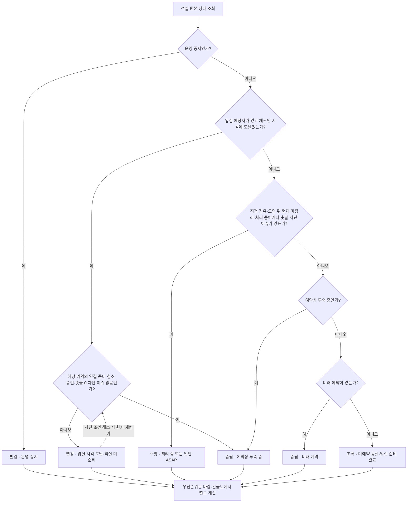

### 예약 수동 표시와 입실 분리

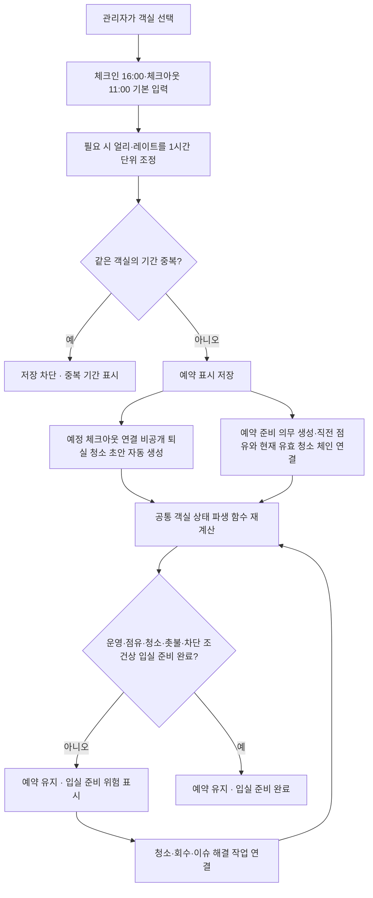

### 예정 체크아웃 자동 종료와 청소 출입 개방

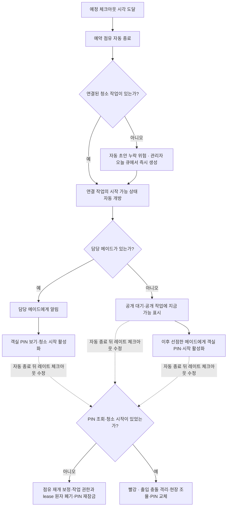

### 시간 우선순위 원칙

```text
준비 마감 = 예정 체크인 시각 - 30분
남은 여유 = 준비 마감 - 현재 시각 - 예상 청소시간
```

다음 체크인이 있는 퇴실·재청소의 준비 마감 30분 버퍼는 네 객실 타입에 공통 적용한다. 연박 청소는 투숙객 요청 완료 시각, 다음 체크인이 없는 작업은 `일반 ASAP`를 사용한다. 관리자가 `긴급`을 별도 지정해 우선순위를 올릴 수는 있지만 체크인 버퍼 자체를 작업마다 임의 변경하는 입력은 MVP에 두지 않는다.

정렬 순서:

1. 관리자 긴급 지정
2. 재청소이면서 오늘 예약이 있는 객실
3. 남은 여유가 음수인 객실
4. 남은 여유가 가장 적은 객실
5. 같은 우선순위에서는 완료 마감이 빠른 객실
6. 다음 예약이 없는 객실은 `일반 ASAP`로 묶어 예약 관련 작업 뒤에 표시

`지금 청소 가능`과 `예정 시각 대기`를 분리해 표시한다. 시간 대기 중인 객실은 선점할 수 있어도 객실 PIN과 시작 버튼은 잠근다.

관리자가 연결된 예약의 얼리 체크인·레이트 체크아웃 시각을 바꾸면 같은 트랜잭션에서 예약 중복을 다시 검사하고 아직 시작하지 않은 작업의 시작 가능 시각·준비 마감·남은 여유·PIN 공개 시각을 즉시 다시 계산한다. 이미 선점된 작업이면 담당 메이드에게 변경 전후 시각과 우선순위 변화를 알린다. 체크아웃을 현재보다 과거로 당기면 예약 점유 종료와 출입 개방을 즉시 실행한다. 아직 자동 종료 전인 체크아웃을 미래로 늦추면 미시작 작업의 시작과 PIN을 다시 잠근다. 이미 자동 종료된 뒤라면 점유 재개 보정 이벤트와 권한 폐기를 기록하고, PIN 조회·청소 시작이 있었다면 빨강 출입 충돌로 격리한다. 공개 시 고정된 단가는 바꾸지 않으며, 이미 청소 중인 작업은 자동 중단하거나 과거로 되돌리지 않고 관리자에게 현장 일정 충돌을 경고한다. 모든 시각 변경은 이전 값·새 값·관리자·시각을 이력으로 남긴다.

빨강 예약·출입 충돌 카드와 알림은 객실 상세의 `영향 확인·충돌 해결`로 연결한다. 이 화면은 예약 변경 전후, 연결 작업·담당·수행 단계, PIN 조회 여부, 활성 lease, 입실 차단 사유를 한 번에 보여준다. 관리자는 상황에 맞게 담당 유지·새 일정 통지, 작업 중단·재공개/재배정, 현장 조율 완료, PIN 교체를 선택하며 작업이 이미 시작됐거나 PIN이 공개된 경우에는 필요한 해결 항목을 모두 마치기 전 종결할 수 없다. 저장에는 필수 사유와 현재 예약·작업 버전 CAS를 사용하고, 동시 변경으로 실패하면 최신 영향을 다시 불러온다. 성공하면 객실 상태를 재계산해 객실 상세와 오늘 큐에 같은 결과를 표시한다. 운영 중지로 기존 예약·작업에 영향이 생긴 경우도 같은 화면 패턴을 사용한다.

### 운영 중지

- 시설 고장, 장기 수리, 안전 문제로 판매·입실·신규 청소 공개를 막을 때 사용한다.
- 객실 번호별 특별 규칙을 만들지 않고 모든 객실에 같은 상태 전이를 적용한다.
- 진행 중인 담당 작업이 있으면 관리자에게 영향과 회수 대상을 먼저 보여준다.
- 예약 표시를 자동 삭제하지 않고 충돌 경고를 보여준다. 관리자가 외부 예약 원본을 먼저 조정한 뒤 이 앱의 수동 복제본도 수정·취소한다.
- 운영 재개 후에는 관리자가 지정한 퇴실 청소 템플릿으로 청소·검수 승인을 거쳐야 초록 상태가 될 수 있다. 별도의 `운영 재개 점검` 청소 유형은 만들지 않는다.

### 날짜별 객실 현황·담당 이력

관리자 `오늘` 탭은 항상 실시간 조치 큐로 고정한다. 날짜 탐색은 `객실 > 일별 현황`에서 제공해 오늘 업무를 보다가 과거 화면으로 바뀌는 혼란을 막는다.

- 첫 진입은 `오늘`이며, 상단에 `이전 날짜`, `오늘`, `다음 날짜`, 날짜 선택기를 고정한다.
- 모바일은 `‹ 8월 14일 · 오늘 ›` 헤더와 캘린더 바텀시트를, 데스크톱은 이전·오늘·다음 버튼, 7일 스트립, 날짜 선택기를 사용한다.
- 선택 날짜·필터·스크롤 위치를 URL과 화면 상태에 보존해 상세를 보고 돌아와도 같은 지점으로 복귀한다.
- 선택 날짜의 객실판은 객실별 예약·투숙, 청소 단계, 당시 담당 메이드, 실제 청소 완료자, 검수 결과, 촛불 수량, 미해결 특이사항, 운영 중지 여부를 요약한다.
- 과거 날짜는 해당 날짜 23:59:59의 `일마감 상태`와 체크아웃→청소→검수→다음 체크인 순서의 당일 구간·이벤트를 함께 보여준다. 과거 화면은 읽기 전용이며, 대표 색상 하나만 보여줘 중간 재배정·반려가 사라지게 하지 않는다.
- 오늘은 현재 실시간 상태와 오늘 이벤트를 보여준다.
- 미래 날짜는 확정된 수동 예약·예정 입퇴실·생성된 청소 작업만 `예정`으로 보여주며, 아직 일어나지 않은 청소 승인이나 입실 준비 완료를 실제 상태처럼 표시하지 않는다.
- 미래 화면에서는 예약 수정·일감 생성·공개·예정 담당 확인만 허용하고 객실 PIN 조회·청소 시작·검수는 실제 시간과 제출 조건을 그대로 적용한다. 계획 서비스일을 넘긴 작업은 `전일 이월`로 표시하고 계획 서비스일과 현장 완료일을 모두 보존한다.
- 객실 상세에는 `선택 날짜`와 `기간 이력` 탭을 둔다. 기간 이력은 `7일`, `30일`, 직접 선택과 예약·청소·검수·촛불·특이사항·운영 상태 필터를 제공한다.
- 메이드 상세의 `담당 이력`도 단일 날짜와 기간을 바꿀 수 있고 객실·청소 유형·진행 결과·재청소 여부로 필터링한다.
- 날짜 계산과 표시 기준은 한국시간으로 통일하고 화면에 기준 시간대를 표시한다. 운영일은 `00:00:00~23:59:59`, 지급 주는 월요일 `00:00:00`부터 일요일 `23:59:59`까지다.
- 객실 상세는 객실 일정·안전 상태의 정본, 메이드 상세는 개인 업무·주급 집계의 정본으로 둔다. 담당·제출·검수·재청소를 바꾸는 행동은 하나의 `청소 상세`에서만 수행하고 객실·메이드 이력은 같은 작업을 딥링크한다.

`현재 담당자` 한 칸을 덮어쓰는 방식으로는 이 요구를 충족할 수 없다. 아래 기록을 분리해 보존한다.

- 담당 이벤트: 공개 선택, 관리자 직접 배정, 취소 요청, 취소 승인·거절, 담당 해제, 재공개, 재배정
- 청소 수행 회차: 객실, 청소 유형, 회차, 예정·현재 책임 메이드, 실제 시작자, 시작 시각, 현장 완료자, 현장 완료 시각, 도움 메모, 제출자, 검수자·결과, 수익 귀속자, 원 재청소 건
- 객실 상태 이벤트: 예약 등록·수정·취소, 자동 입실·퇴실, 청소 단계, 촛불 증감, 특이사항 등록·해결, 운영 중지·재개
- 관리자 정정: 원 기록을 삭제하지 않고 정정 전후 값·사유·관리자·시각을 별도 이벤트로 추가

모든 운영 이벤트에는 불변 사용자 ID, 당시 표시 이름 스냅샷, `effective_at`(현장 효력 시각), `recorded_at`(서버 기록 시각), 전후 값, 사유, 연결 작업 ID를 남긴다. 단, 객실 PIN 원문은 전후 값이나 과거 상태에 저장하지 않고 변경·조회가 있었다는 사실만 기록한다. 이름·로그인 아이디·객실 타입·예약 시각을 나중에 바꿔도 과거 화면을 현재 값으로 다시 쓰지 않는다. 예정 체크인·체크아웃의 자동 전이도 조회 시 계산만 하지 않고 실행된 서버 이벤트로 기록한다.

과거 화면에는 일반 `수정·삭제`를 두지 않고 관리자만 `정정 추가`를 사용한다. 정정 전 원값, 새 값, 효력 시각, 필수 사유, 연결된 객실·작업·주급 영향을 미리 보여준 뒤 저장하며 원 기록은 유지한다. 운영 화면은 정정 반영 결과를 기본으로 보여주되 `당시 기록과 정정 보기`에서 원 이벤트와 정정을 함께 펼친다. 감사 화면은 두 이벤트를 항상 분리해 보여준다. 이미 지급 완료된 금액은 과거 지급을 다시 쓰지 않고 다음 주 정정·상계로, 제출 사진과 검수 결과 변경은 새 버전으로 처리한다.

운영이력과 보안 감사로그는 연결하되 용도와 화면을 분리한다.

| 구분 | 운영이력 | 감사로그 |
|---|---|---|
| 목적 | 객실·청소 업무 흐름 이해 | 보안·책임 추적 |
| 예 | 예약 변경, 공개, 선점, 재배정, 시작, 제출, 검수 | 로그인 실패, 권한 거부, PIN 조회, 객실 타입 단가 설정·지급 수정 |
| 화면 | 객실·청소·메이드 상세 | 권한 있는 관리자 감사 화면 |
| 표현 | 관련 이벤트를 한 업무 단계로 묶어 읽기 쉽게 표시 | 원 요청·사용자·세션·전후 값을 축약 없이 보존 |

모바일 일별 객실 카드는 객실 번호·타입, 텍스트 상태와 색, 당일 체크아웃·다음 체크인, 청소 단계·현재 담당, 마감, 촛불·차단·재배정·재청소 배지만 노출한다. 오늘·미래 카드는 현재 단계의 주 행동 한 개만, 과거 카드는 `상세 보기`만 제공한다. 관리자 주 행동 우선순위는 `입실 차단 해결(복수 차단은 통합 해결 상세) → 검수 → 긴급 배정·공개 → 일감 생성 → 상세 보기`로 고정하고, 메이드는 `미전송 재시도 → 계속 청소 → 시작 → 선택 → 결과 보기` 순으로 고정한다. 오버플로에는 저위험 보조 행동만 두고 상태 변경·PIN·정산은 상세에서 처리한다. 데스크톱은 같은 정보를 행과 열로 확장한다.

현장 완료 없이 담당만 됐거나 중단된 건은 담당 이력에는 남지만 완료 청소와 수익으로 세지 않는다. 재청소는 원 청소를 덮어쓰지 않고 연결된 별도 수행 회차로 표시해 각 회차의 담당자·실제 수행 날짜·결과를 볼 수 있게 한다. 현재 담당을 바꿔도 과거 실제 수행자·제출자·승인자·수익 귀속자는 바뀌지 않는다.

계획일, 실제 시각, 수익 귀속일은 다음처럼 분리하고 UI 용어를 고정한다.

- `계획 서비스일`: 객실 운영상 청소를 계획한 날짜
- `현장 완료 시각`: 실제 수행 회차가 끝난 시각. 오프라인이면 기기 완료 시각과 서버 수신 시각을 둘 다 표시
- `수익 귀속일`: 승인 수익을 특정 지급 주에 고정한 날짜

객실 일별 현황은 운영 이벤트의 한국 날짜, 청소 완료 이력은 `현장 완료일`, 주급 화면은 `수익 귀속일`을 기본 필터로 사용하고 화면에 기준을 명시한다. 계획 대비 지연을 볼 때만 `계획 서비스일`을 함께 비교한다.

온라인 현장 완료는 서버 시각을 기준으로 하고, 오프라인 완료는 클라이언트 시각과 마지막 서버 시각 오프셋을 함께 보존한다. 날짜 경계나 기기 시각 이상이 감지되면 자동 귀속하지 않고 관리자 확인 대상으로 표시한다. 늦은 사진 업로드나 늦은 검수는 이미 확정한 수익 귀속일을 바꾸지 않는다.
자정을 넘어 끝난 작업은 최종 성공 수행 회차의 현장 완료 시각이 속한 한국 날짜를 현장 완료일과 수익 귀속일로 사용한다. 오프라인 시각이 자정 또는 일요일·월요일 경계와 충돌하면 관리자 확인 전까지 수익 귀속을 보류한다.

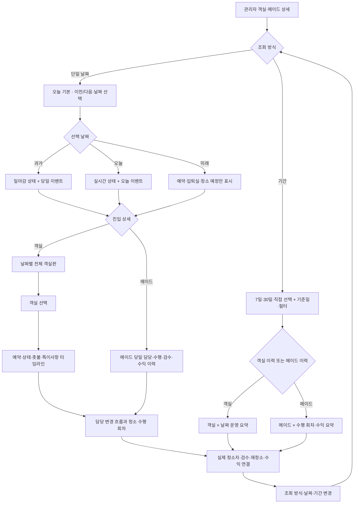

## 6. 메이드·공개 일감 UX 재설계

### 공개 일감 카드에 필요한 정보

- 계획 서비스일
- 객실 번호와 객실 타입
- 청소 유형: 퇴실 청소 / 연박 청소 / 재청소
- 고정 청소 단가
- 유형별 한 줄 일정: 퇴실은 예정 체크아웃→준비 마감→다음 예정 체크인, 연박은 요청 출입 가능 범위→요청 완료 시각, 재청소는 시작 가능 시각→다음 예정 체크인·원 작업
- `지금 가능` / 예정 체크아웃 대기
- 청소 시작 가능 시각
- 준비 마감과 남은 여유시간
- 예상 청소시간
- 얼리 체크인·레이트 체크아웃·긴급·특이사항 배지

계획 서비스일은 미래 작업을 같은 시각의 다른 날짜와 구분하도록 카드 상단에 반드시 표시한다. 일정 행은 청소 유형에 해당하는 값만 보여주며, 긴 객실 타입명은 두 줄까지 허용하고 나머지 일정은 상세로 보낸다.
객실 PIN, 고객 이름, 상세 민감 메모는 공개 목록에 노출하지 않는다.
다음 예약이 없는 작업은 가짜 마감시각을 만들지 않고 `마감 없음 · 일반 ASAP`로 표시한다.

### 일감 공개·선택 흐름

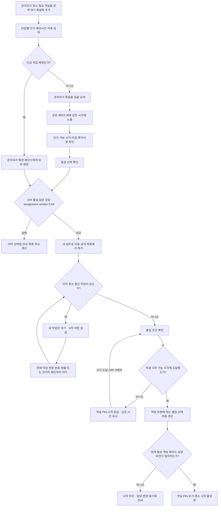

일괄 공개는 화면에서 여러 번 순차 저장하는 기능이 아니라 하나의 서버 명령이어야 한다. 공개 전 묶음 전체를 검증하고, 성공하면 모든 작업에 같은 `published_at`을 기록한다. 하나라도 유효하지 않으면 아무 작업도 공개하지 않고 문제 객실을 표시한다. 푸시는 공개 사실을 알리는 보조 수단이며, 선착순 기준은 푸시 수신 시각이 아니라 서버의 공개 상태와 claim 도착 순서다.

선착순 claim만 원자적으로 만들어서는 충분하지 않다. 작업당 활성 담당은 데이터베이스에서 한 건만 허용하고, claim·관리자 직접 배정·취소 승인·담당 해제·재배정은 모두 요청이 본 `assignment_version`을 조건으로 한 CAS 전이로 처리한다. 같은 작업에 claim과 직접 배정이 겹치거나 취소 승인과 시작이 겹치면 한 요청만 성공하고 패자는 최신 상태를 다시 받아야 한다. 메이드당 활성 수행 회차도 한 건만 허용해 두 기기의 동시 시작을 서버 유일 제약으로 막는다.

### 여러 일감 선점과 한 개 작업 진행

- 한 메이드는 여러 일감을 선점할 수 있다.
- `청소 중` 상태는 한 번에 한 객실만 허용한다.
- 다음 작업을 시작하려면 현재 작업을 `현장 완료·업로드 대기`로 전환하거나 서버 제출하거나 관리자가 중단 처리해야 한다.
- `현장 완료·업로드 대기`는 물리적 청소가 끝났고 체크·사진·메모가 기기에 안전하게 저장됐지만 일부 미디어가 아직 서버에 전송되지 않은 상태다. 이 상태는 `청소 중 1개` 슬롯을 해제하지만 검수 대기로 넘기지는 않는다.
- 너무 많은 일감을 선점해 마감 위험이 생기면 메이드와 관리자 모두에게 경고한다.
- 강제 개수 제한은 두지 않고 `선점 수·예상시간 합계·가장 가까운 마감`을 보여준다. MVP 경고는 이 세 값으로 단순하게 계산하고 이동시간까지 최적화하는 스케줄러는 만들지 않는다.

### 담당 취소 요청

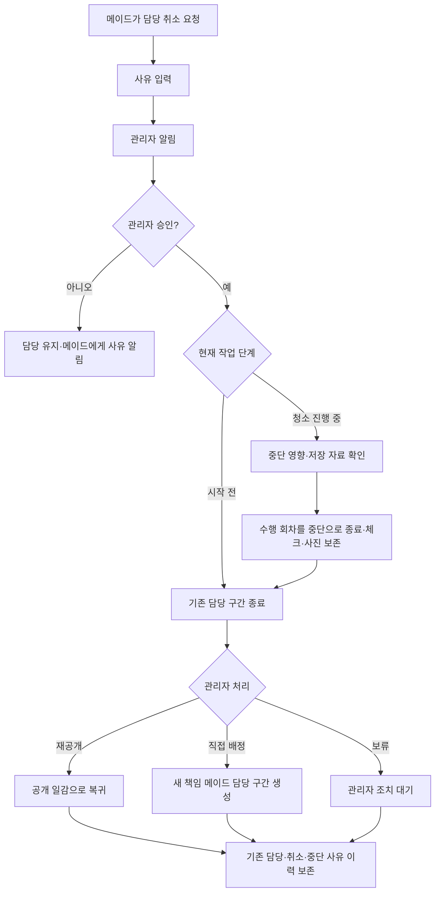

담당 취소 요청은 즉시 모든 활성 관리자 알림함과 `오늘` 큐에 등록한다. 관리자가 아직 응답하지 않은 동안에는 담당을 그대로 유지하고 같은 요청을 중복 생성하지 않는다. 요청 후 15분이 지났거나 계산된 남은 여유가 60분 미만이면 빨강으로 단계 상승해 재알림하며, 다른 관리자도 처리할 수 있다. 자동 취소나 자동 재공개는 하지 않는다.
담당 취소 요청은 현장 완료 전까지만 제공한다. 현장 완료 뒤에는 미디어 동기화·제출·검수 흐름을 마쳐야 하며, 문제가 생기면 관리자 동기화 충돌 처리로 보낸다.

### 청소 수행

- 시작 버튼은 작업 시작 가능 시각에 도달하면 자동으로 활성화한다.
- 현장 벨 확인은 앱 버튼이나 제출 조건으로 강제하지 않는다.
- 시작 즉시 다른 담당 작업의 시작 버튼을 잠근다.
- 체크리스트와 사진 항목은 `객실 타입 × 퇴실·연박·재청소`별 템플릿을 사용한다.
- 관리자는 설정에서 체크리스트·사진 항목과 사진의 필수·선택 여부를 수정할 수 있다.
- 템플릿 편집은 `초안 저장`과 `게시·활성화`를 분리한다. 미완성 초안은 신규 작업에 사용하지 않으며, 미리보기와 필수 항목 검증을 통과해 게시한 버전만 해당 조합의 활성 버전이 된다.
- 게시할 때 새 버전을 만들고, 청소 작업 생성 시 활성 버전을 작업에 고정한다. 이후 설정 변경은 이미 생성·진행 중인 작업에 소급하지 않는다.
- 12개 조합을 처음부터 반복 작성하지 않도록 기존 템플릿 복제와 여러 객실 타입 일괄 적용을 제공하고, 복제 후 타입별 차이만 수정하게 한다.
- 연박 청소는 투숙객 요청 시간과 허용 범위만 보여준다.
- 체크, 사진, 메모는 기기 내구 저장소에 자동 임시저장한다.
- 필수·선택 사진 모두 작업 화면의 카메라 촬영과 기기 갤러리·파일 선택을 허용한다. 여러 장을 먼저 촬영한 뒤 한 번에 올릴 수 있어야 하며 촬영 출처나 EXIF 유무를 제출 조건으로 사용하지 않는다.
- 사진에는 카메라·갤러리 선택 경로, 업로드 시각, 파일 해시, 연결 항목, 제출 버전을 기록한다. EXIF 시각은 참고값일 뿐 청소 완료일의 근거로 사용하지 않는다. 같은 파일이 여러 필수 항목에 반복되면 경고하되 제출을 자동 차단하지 않는다.
- 사진 업로드 중·실패·재시도 상태를 각 사진에 표시한다.
- 필수 사진이 모두 업로드 완료 상태가 아니면 누락 항목을 표시하고 전체 청소 제출을 잠근다. 선택 사진은 없어도 제출할 수 있다.
- 통신 장애가 있으면 `현장 완료·업로드 대기`로 전환해 물리적인 진행 슬롯을 해제하고, 앱 상단에 미전송 건수를 계속 표시하며 같은 기기에서 앱을 다시 열 때 자동 재시도한다. 다만 다음 객실 시작은 온라인으로 담당·시각을 재검증하고 객실 PIN을 새로 조회한 뒤에만 허용한다. 서버에 필수 사진이 모두 도착하기 전에는 이전 작업의 제출·검수를 계속 막는다.
- 사진 API만 실패하고 일반 통신이 가능하면 작은 완료 manifest를 먼저 서버에 보내 `미디어 동기화 대기`로 표시한 뒤 온라인 검증을 거쳐 다음 작업을 시작할 수 있다. 완전 오프라인에서는 이미 온라인으로 시작한 현재 작업의 입력·현장 완료만 이어갈 수 있고 새 작업 시작·새 공개 일감 선점·새 PIN 조회는 막는다.
- 오프라인 작업 권한은 불변 사용자 ID·한 기기·이미 시작한 현재 작업 ID·담당 버전·만료 시각에 묶인 서버 서명 lease다. 서버는 모든 기기를 합쳐 사용자당 활성·미만료 lease를 하나만 발급하며, 기존 기기가 온라인으로 반납·해제했거나 만료되기 전에는 두 번째 기기의 발급을 거절한다. 오프라인인 기존 lease를 단순 폐기 표시하고 새 기기에 겹치는 lease를 내주지 않는다.
- lease는 온라인 시작 트랜잭션에서 발급하고 객실 PIN 원문을 포함하지 않는다. 새 기기 요청이 거절되면 현재 lease 기기와 만료 시각을 안내하되 다른 기기에서 강제 탈취하지 않는다.
- 오프라인 큐에는 체크·사진·메모·촛불·제출 UUID를 암호화해 저장하고, 같은 idempotency key로 재전송해 서버 제출이 중복 생성되지 않게 한다.
- 기기는 현재 작업 이벤트에 단조 증가 순번을 붙이고 재연결 시 서버는 같은 lease의 이벤트 묶음을 순서대로 원자 재생한다. 다른 작업 시작은 이 재생과 서버 종료 확인 뒤 별도의 온라인 시작 트랜잭션으로 처리한다.
- 오프라인 동안 담당 해제·운영 중지·다른 기기 제출이 발생하면 늦은 업로드로 현재 담당이나 객실 상태를 덮어쓰지 않는다. 자료는 버리지 않고 `동기화 충돌`로 관리자에게 보여준다.
- 서버 재생 중 담당 버전·권한·순서가 맞지 않으면 해당 회차를 정상 완료하지 않고 충돌로 격리한다. 관리자는 `과거 수행 기록으로만 수용`, `운영 효력 기각`, `정정으로 유효 작업·제출에 연결` 중 하나로 종결한다. 어느 선택도 현재 객실 상태·현재 담당·검수·수익을 자동으로 바꾸지 않으며, 정정 후 유효한 재제출이 필요한 경우에만 별도 서버 검증 흐름을 다시 탄다.
- 서버는 필수 파일의 형식·크기·해시·작업 소유권을 확인한 뒤에만 `검수 대기`로 전환한다. 그 전에는 객실을 초록으로 만들거나 검수를 열거나 수익을 생성하지 않는다.
- 제출 전에는 사진을 교체·삭제할 수 있지만 제출 후 변경은 새 제출 버전을 만든다. 새 버전 생성 트랜잭션은 작업의 `current_submission_version_id`를 새 버전으로 옮기고 이전 검수 대기 버전을 `SUPERSEDED`로 바꾼다. 관리자에게 보였던 이전 버전과 사진은 불변으로 보존하되 더 이상 승인·반려할 수 없다.
- 제출 시 이번 청소에서 새로 둔 촛불 개수를 입력한다.
- 청소 시작·현장 완료·제출은 요청 시점의 활성 책임 메이드만 할 수 있고 서버가 담당 버전과 사용자·기기를 다시 검사한다. 도움 인력은 메모만 남기며 대신 조작하거나 제출할 수 없다.
- 재배정은 기존 담당 구간과 진행 세션을 먼저 종료한 뒤 새 담당 구간을 만든다. 이전 담당의 늦은 제출은 이력과 충돌 자료로만 보존하고 현재 객실 상태·담당·수익을 바꾸지 않는다.

### 사진·이력 보존

- 객실 상태, 예약 버전, 담당 구간, 청소 수행 회차, 체크리스트 결과, 검수·재청소, 촛불·특이사항, 정산·감사 이력은 자동 만료 없이 계속 보존한다.
- 청소 제출 사진은 각 제출 버전의 승인 또는 반려 시각부터 180일간 보존한다. 검수 미결 제출은 결정 전까지 만료 계산을 시작하지 않는다.
- 객실 특이사항·컴플레인 증빙 사진은 해당 이슈의 관리자 해결 시각부터 180일간 보존한다.
- 중단 회차 증빙·동기화 충돌 사진은 관리자가 충돌을 종결한 시각부터 180일간 보존한다. 제출 사진으로 승격되지 않아도 고아 업로드로 분류하지 않는다.
- 작업·이슈·제출 버전에 연결되지 않은 고아 업로드는 업로드 시각부터 30일 뒤 삭제한다.
- 만료 시 원본뿐 아니라 썸네일·리사이즈·미리보기·CDN 및 애플리케이션 캐시까지 삭제하고 캐시 무효화를 확인한다.
- 삭제 후에도 사진 항목명, 필수·선택, 카메라·갤러리 선택 경로, 업로드 시각, 파일 해시, 제출 버전, 검수 결과와 삭제 시각은 남긴다. 화면에는 `원본 보관기간 만료`로 표시한다.
- 미해결 컴플레인이나 관리자 보존 요청이 있으면 남은 보존기간 카운트다운을 멈춘다. 해결·보존 해제 후에는 새 180일을 부여하지 않고 남아 있던 기간부터 재개한다.
- 삭제 작업은 실패 파일을 재시도하고 대상·수행 시각·원본/파생본/캐시별 결과를 감사 이벤트로 기록한다.

### 청소 템플릿과 제출 게이트

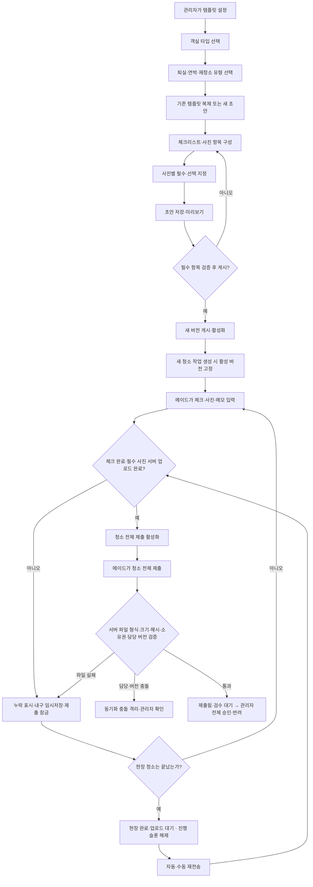

## 7. 검수·재청소 UX 재설계

### 전체 청소 단위 검수

관리자 검수 화면은 다음을 한 화면에서 보여준다.

- 객실·청소 유형·최종 수행 회차의 책임 메이드·현장 완료자·제출자·시작/완료 시각
- 체크리스트 완료 요약
- 사진 전체 갤러리
- 메이드 특이사항과 촛불 추가 개수
- 기존 객실 차단 이슈
- `전체 승인`과 `전체 반려`

사진은 확대할 수 있지만 사진마다 확인 버튼을 누르게 하지 않는다. 반려할 때만 문제 사진이나 항목을 선택적으로 첨부한다.

검수 결정은 작업의 `current_submission_version_id`이면서 `SUBMITTED`인 버전에만 허용하고 제출 버전당 한 건만 둔다. `SUBMITTED → APPROVED` 또는 `SUBMITTED → REJECTED` 조건부 전이와 `UNIQUE(submission_version_id)` 결정 레코드를 사용하며, `SUPERSEDED`나 그 밖의 과거 버전은 수익·재청소·촛불 증감·객실 상태 같은 운영 부작용을 만들 수 없다. 승인 시 최신 제출 고정·수익 0/1건·객실 상태 재계산을, 반려 시 결정 기록·재청소 생성·원 제출자 알림을 각각 한 트랜잭션으로 묶는다. 두 관리자가 동시에 승인·반려해도 한쪽만 성공하고 다른 화면은 이미 처리된 최종 결과를 보여준다.

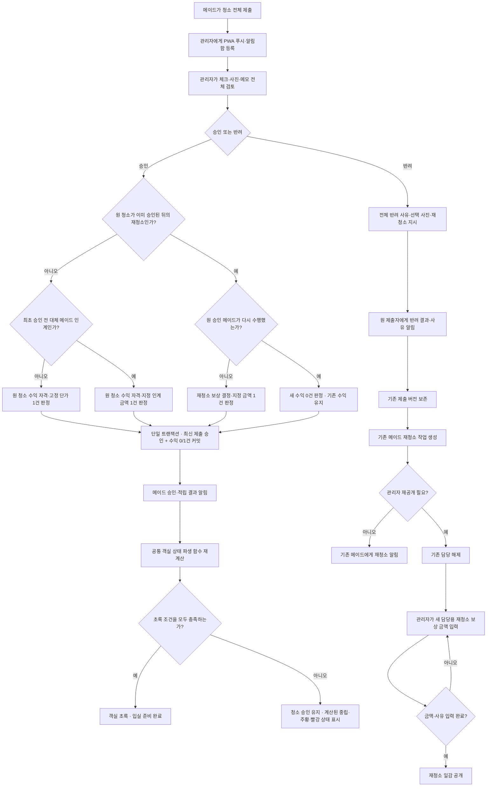

### 재청소 금액

- 최초 검수 반려 전에는 아직 누구에게도 수익을 만들지 않는다. 기존 메이드가 재청소해 최종 승인되면 최초 공개 때 고정한 객실 청소 단가를 한 번만 받으며, 수익 귀속일은 최종 승인된 재청소를 현장 완료한 날짜로 고정한다.
- 최초 승인 전 반려로 만든 모든 재청소는 원 작업과 같은 예약 준비 의무를 공유하고 의무의 현재 유효 시도만 새 작업으로 바꾼다. 원 시도와 이전 재청소는 이력으로 남지만 해당 예약을 준비 완료로 만들 수 없다.
- 관리자가 다른 메이드에게 재공개할 수 있다.
- 최초 승인 전에 다른 메이드가 인계받으면 기존 메이드는 0원이고, 새 메이드는 관리자가 지정한 재청소 금액 하나만 받는다. 수익 귀속일은 새 메이드가 최종 승인된 재청소를 현장 완료한 날짜이며, 객실 기본 단가와 재청소 금액을 함께 적립하지 않는다.
- 이미 승인된 청소에 고객 컴플레인이 생겨 재청소하는 경우 기존 승인 수익은 취소하거나 차감하지 않는다. 기존 메이드의 재청소는 추가 금액이 없고, 다른 메이드가 맡을 때만 관리자 지정 재청소 금액 한 건을 추가한다.
- 별도 금액에는 대상 메이드·금액·사유·입력 관리자를 반드시 남긴다.
- 예약 연결 퇴실 청소·연박 청소처럼 한 번 유상 처리해야 하는 원 업무를 만들 때 불변 `earning_entitlement_id`를 하나 발급한다. 최초 승인 전의 반려·재작업·다른 메이드 인계·제출 버전은 모두 같은 수익 자격을 공유한다.
- 최종 승인 트랜잭션은 최신 유효 제출 버전만 승인하고 이 수익 자격을 정확히 한 번 정산한다. 기존 책임 메이드가 끝냈으면 최초 공개 고정 단가, 승인 전 다른 메이드가 인계했다면 관리자 지정 인계 금액 중 하나만 지급하며 두 사람·두 금액을 함께 만들지 않는다. 원 청소 정산에는 데이터베이스 `UNIQUE(earning_entitlement_id)`를 적용한다.
- 이미 승인된 원 청소의 컴플레인 재청소는 새 원 청소 수익 자격을 만들지 않는다. 기존 메이드면 새 수익이 없고, 다른 메이드 보상은 관리자 결정 때 불변 `reclean_compensation_decision_id`를 발급해 `UNIQUE(reclean_compensation_decision_id)`로 한 번만 정산한다. 이전 제출 버전과 회차는 이력으로 남지만 별도 수익을 만들 수 없다.

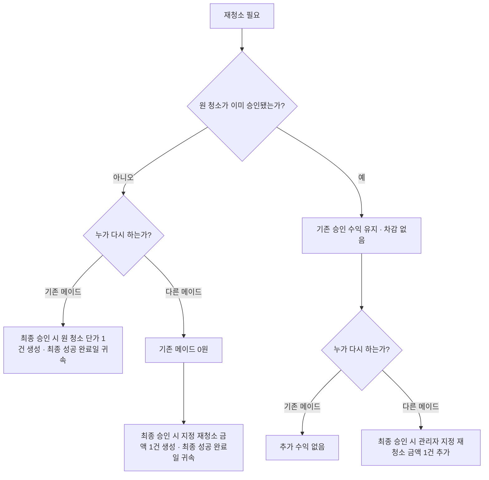

## 8. 주급·메이드 평가 UX 재설계

### 주급 원장

- 검수 승인된 청소만 확정 수익이 된다.
- 최초 승인 전 모든 수행 회차·제출 버전은 하나의 원 청소 수익 자격을 공유하고 최종 승인 시 정확히 한 번만 정산한다. 일반 청소의 공개 단가와 승인 전 대체 메이드의 관리자 지정 금액 중 하나만 사용한다. 승인 후 다른 메이드 재청소 보상은 별도 관리자 결정 ID로 한 번만 생성한다.
- 수익 귀속자는 승인 시점의 현재 담당자를 다시 조회하지 않고 승인된 수행 회차 또는 관리자 지정 재청소 보상에 고정된 불변 사용자 ID를 사용한다.
- 공개 당시 고정된 단가 스냅샷을 사용한다.
- 주간 귀속은 `수익 귀속일` 기준으로 확정한다.
- 최초 반려 후 재청소한 건의 수익 귀속일은 최종 승인된 수행 회차의 현장 완료일이다. 이미 승인된 청소의 컴플레인 후 재청소는 원 수익의 귀속일을 바꾸지 않고, 다른 메이드 보상만 새 재청소 완료일에 귀속한다.
- 일요일 서비스 건을 월요일에 승인해도 아직 지급 완료 전이면 지난주 대상에 포함한다.
- 다음 월요일부터 보이는 `지난주 지급 대상`은 `지급 완료` 전까지 계산 중인 값이며, 늦은 승인·유효 정정을 반영해 다시 계산한다.
- 관리자가 외부 송금 직전에 `지급 진행`을 누르면 최종 금액 스냅샷과 포함 수익 ID 목록을 잠그고 담당 관리자를 기록한다. 실제 송금 뒤 `지급 완료`로 바꾸며, 그 뒤에는 지급 기록을 직접 수정하지 않고 늦은 승인·정정 차액을 다음 주 정정·상계로 이월한다.
- 지급 주기 레코드는 `UNIQUE(maid_id, week_start)`로 한 건만 만들고 `OPEN → PAYING → PAID` CAS 전이를 사용한다. 청소 승인·지급 정정·상계 생성과 `OPEN → PAYING`은 같은 지급 주기 행을 잠가 직렬화하고 각 정정은 고유 원천 ID로 중복을 막는다. 수익·정정이 먼저면 열린 지난주 대상에 포함하고, `PAYING` 또는 `PAID`가 먼저면 다음 주 정정 항목을 같은 트랜잭션에서 생성한다.
- `PAYING`에는 관리자·주차·금액·시작 시각을 표시하고 다른 관리자의 지급 시작을 막는다. 실제 송금 뒤 앱 기록이 실패하거나 오래 미완료면 자동으로 `OPEN`으로 되돌리지 않고 `정산 확인 필요`로 유지한다. 담당 관리자가 송금 완료를 재기록하거나, 송금하지 않았음을 확인하고 필수 사유로만 `OPEN` 복귀할 수 있다.
- 실제 송금은 앱 밖에서 진행하고, 관리자는 송금 후 앱에서 `지급 완료`만 기록한다.
- `지급 완료`는 메이드별 지난주 잔액 전액에만 허용하고 부분 금액 입력은 제공하지 않는다.
- 지급 기록은 삭제하지 않고 정정·상계 이벤트로 수정한다.

### 관리자 화면

1. 이번 주 적립 중
2. 지난주 지급 대상
3. 외부 송금 전 `지급 진행` 선점
4. 외부 전액 지급 후 `지급 완료` 기록
5. 지급 완료 이력
6. 지급 정정·상계 내역

### 메이드 화면

1. 이번 주 예상
2. 승인 확정
3. 검수 대기
4. 지난주 지급 예정
5. 지급 완료 이력

### 벌점·컴플레인

- 청소 반려가 곧바로 벌점이 되지 않는다.
- 컴플레인 접수 후 사실 확인과 관리자 판단을 거쳐 평가 기록을 남긴다.
- 벌점과 컴플레인은 주급에서 자동 차감하지 않는다.
- 메이드 관리 화면에서 기간별 추세와 구체 근거를 참고 정보로 보여준다.
- 메이드가 내용을 확인했다는 상태와 이의 메모를 남길 수 있게 한다.

관리자는 청소 상세 또는 메이드 상세에서 컴플레인을 접수한다. 접수 폼에는 관련 객실·청소 작업, 접수일, 분류, 내용, 증빙을 두고 관련 청소를 특정할 수 없을 때만 연결 없음과 사유를 허용한다. 확인 단계에서는 사실 확인 메모를, 판정 단계에서는 `확인됨 / 확인 불가 / 사실 아님`, 선택 벌점·평가 메모, 재청소 필요 여부와 연결 작업을 기록한다.

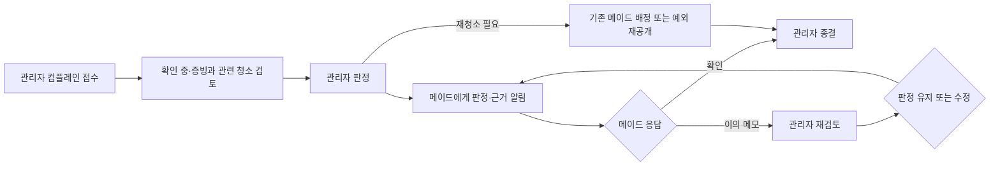

판정 알림은 해당 컴플레인 상세로 연결한다. 메이드는 `내용 확인` 또는 이의 메모만 남길 수 있고 판정·벌점·재청소를 직접 바꾸지 못한다. 관리자는 이의를 검토해 판정을 유지하거나 새 버전으로 정정한 뒤 종결하며, 접수·확인·판정·메이드 응답·정정·종결을 원본 삭제 없는 이벤트로 보존한다. 응답이 없다는 이유만으로 자동 벌점·자동 종결·주급 차감을 실행하지 않는다.

## 9. PWA 알림·로그인 비밀번호·객실 PIN·권한

### 계정 생성·첫 로그인

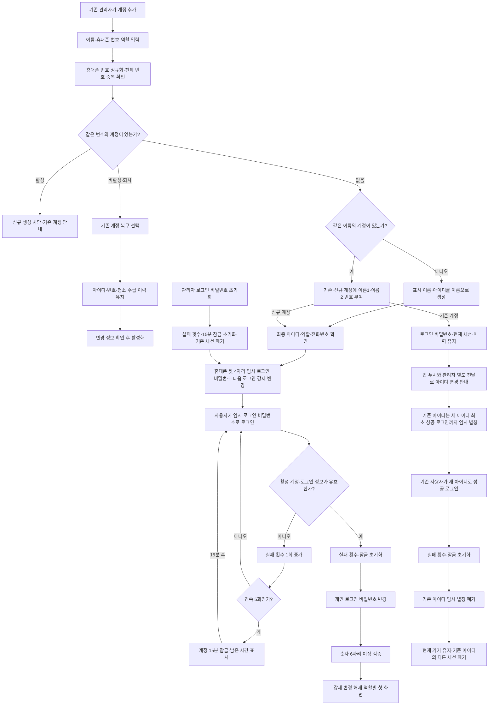

### 알림 이벤트

관리자에게:

- 청소 제출 완료
- 담당 취소 요청
- 담당 취소 15분 미처리·남은 여유 60분 미만 단계 상승
- 시작 가능 시각 도달·미선점
- 마감 위험·기한 초과
- 입실 예정자가 있는 객실의 체크인 시각 도달·미준비
- 자동 체크아웃 뒤 레이트 체크아웃 수정으로 생긴 청소 출입·PIN 충돌
- PIN 변경 중 장기 미완료·도어락–앱 PIN 불일치 확인 필요
- 지급 진행 중 장기 미완료·정산 확인 필요
- 컴플레인 판정 후 메이드 이의 제기·미종결
- 촛불이 남은 예약 객실
- 메이드가 등록한 입실 차단 특이사항
- 메이드 비활성·퇴사 인계 미완료·24시간 업로드 권한 만료 임박
- 동기화 충돌 발생·미처리

메이드에게:

- 일감 선택 성공·실패
- 새 일감 묶음 일괄 공개
- 예정 체크아웃 시각 도달·청소 시작 가능
- 예약 시각 변경·청소 출입 재잠금 또는 관리자 충돌 확인 대기
- 담당 변경·취소 승인 결과
- 비활성 예정·현재 작업 마무리 또는 중단 결정·업로드 전용 남은 시간
- 검수 승인·반려
- 재청소 요청
- 컴플레인 판정·확인 요청·관리자 재검토 결과
- 주급 확정·지급 완료
- 동기화 업로드 검토 중·관리자 확인 필요

계정 아이디 변경·로그인 비밀번호 초기화·비활성 처리 시작은 역할과 관계없이 해당 사용자에게 앱 내부 알림을 남긴다. 아이디만 바뀐 기존 동명이인 계정은 새 아이디 최초 로그인 전까지 로그인 비밀번호와 기존 세션을 유지하고, 최초 성공 로그인 시 현재 기기 외 기존 아이디 세션을 폐기한다. 로그인 비밀번호 초기화는 즉시 모든 세션을 폐기한다. 비활성·퇴사는 `활성 → 비활성 처리 중 → 업로드 전용 → 비활성·퇴사 완료`로 진행하며, 처리 시작 때 신규 업무·새 PIN만 즉시 막고 현재 작업·제출에 필요한 제한 세션은 아래 인계 정책에 따라 유지한다. 일반 세션은 최종 완료 때 폐기한다. 아이디 변경은 로그아웃 상태에서도 전달돼야 하므로 앱 내부 알림만으로 끝내지 않는다.

PWA 푸시가 거부되거나 전달되지 않아도 앱 내부 알림함에서 동일한 이벤트를 확인할 수 있어야 한다. 알림을 누르면 해당 객실·청소·정산 상세로 바로 이동한다.

- 첫 화면 진입 즉시 브라우저 권한창을 띄우지 않고, 알림이 필요한 이유와 받을 이벤트를 설명한 뒤 사용자가 `알림 켜기`를 눌렀을 때 요청한다.
- 푸시 허용·거부·지원 안 됨·구독 만료 상태를 내 정보에 표시하고 다시 설정하는 방법을 제공한다.
- 관리자는 메이드별 마지막 앱 접속과 푸시 수신 불가 상태를 볼 수 있지만, 푸시 실패만으로 담당을 자동 해제하지 않는다.
- 푸시 성공을 업무 처리 완료로 간주하지 않는다. 미선점·마감 위험·입실 미준비 같은 위험은 관리자 `오늘` 큐에 해결될 때까지 남긴다.
- 같은 위험을 무제한 반복 발송하지 않고 단계 상승이나 정해진 재알림 시점에만 다시 보내며, 알림함에서는 하나의 사건으로 묶는다.

### 개인정보 표시·보존

- 선택 입력한 고객 이름은 관리자 예약 상세에서만 보여준다. 관리자 객실 목록, 메이드 공개 일감·담당 상세, 푸시·앱 알림, 사진 파일명과 감사로그에는 넣지 않는다.
- 고객 이름은 운영 이벤트에 복제하지 않고 암호화된 예약 개인정보 필드에만 둔다. 체크아웃 시각부터 180일 후 해당 필드를 삭제하며, 투숙 전 취소된 예약은 취소 시각부터 계산한다. 예약·객실·시각·상태 이력은 예약 ID로 남고 화면에는 `익명 고객`으로 표시한다.
- 특이사항·청소 메모 같은 공유 자유입력에는 고객 이름·휴대폰·이메일을 쓰지 않도록 고정 안내한다. 전화번호·이메일 패턴은 서버 저장 전에 경고·마스킹하고, 메이드·푸시·알림·장기 운영이력에는 가림 처리된 업무 문구만 남긴다. 구조화된 고객 이름을 자유입력으로 자동 복사하지 않는다.
- 활성 메이드의 휴대폰 전체 번호는 계정 상세에서만 다루고 목록에서는 뒷 4자리만 표시한다.
- 휴대폰 원문은 운영·감사 이벤트에 기록하지 않고 마스킹 값과 변경 사실만 남긴다. 퇴사 완료 180일 후 전체 번호를 계정 개인정보 저장소·검색 인덱스·캐시에서 삭제한다. 동일인 중복·재입사 비교를 위한 비가역 서버 키 해시만 남기며 화면에서 번호를 복원할 수 없게 한다.
- 업무·정산 이력의 영구 보존 원칙은 불변 사용자 ID와 업무 메타데이터에 적용하며 고객 이름·휴대폰 원문·로그인 비밀번호·세션·객실 PIN 원문에는 적용하지 않는다.

### 객실 PIN

- 앱은 암호학적으로 안전한 `새 4자리 추천`과 직접 입력을 제공한다.
- 변경 화면을 열면 서버에서 객실·현재 버전·관리자에 묶인 `PIN 변경 중` lease를 CAS로 선점한다. 다른 관리자는 진행자와 시작 시각만 보고 수정할 수 없으며, 메이드의 기존 PIN 조회도 즉시 잠근다.
- 관리자가 실제 도어락을 바꾼 뒤 앱에서 새 값을 한 번 저장하면 암호화된 현재 PIN으로 갱신하고 lease를 닫으며, 별도의 완료 확인 절차는 추가하지 않는다.
- 저장 실패·연결 종료 시 새 PIN 평문은 영속 저장하지 않고 서버에는 불일치 확인 필요 상태만 남긴다. 재진입한 관리자는 실제 PIN 재입력·저장 재시도 또는 도어락을 이전 값으로 원복한 뒤 사유 있는 변경 취소만 할 수 있다. 해결 전에는 입실 준비 완료·PIN 조회를 차단하고 관리자 오늘 큐에 유지한다.
- 저장 전후 값 전체를 확인 모달에 함께 노출하지 않는다.
- 관리자 객실 목록에서는 항상 마스킹한다.
- 담당 메이드에게만 예정 체크아웃 또는 연박 허용 시각 이후 공개한다.
- PIN을 연 뒤 30초가 지나거나 화면 이동·앱 백그라운드·기기 잠금·담당 해제·출입 시각 재잠금이 발생하면 즉시 다시 마스킹한다. `지금 숨기기`도 제공한다.
- PIN은 푸시·앱 알림·목록·클립보드에 넣지 않는다. 다시 조회할 수는 있지만 매번 감사 기록을 남긴다.
- 서버에서는 복호화 가능한 전용 암호화 저장소에 두고 암호화 키를 애플리케이션 데이터와 분리한다. 권한이 확인된 PIN 조회 엔드포인트만 잠깐 복호화하며 응답은 `no-store`로 보낸다. 브라우저 영속 저장소·서비스워커 캐시·오프라인 큐·로그·분석 이벤트에는 원문을 저장하지 않고, 재마스킹과 함께 화면 메모리의 평문도 지운다.
- 누가 언제 어떤 작업 때문에 조회했는지 감사 로그를 남긴다.
- 담당 메이드의 조회 사유는 연결된 청소 작업으로 자동 기록하고, PIN을 볼 때마다 별도 사유를 다시 입력시키지 않는다.
- 앱의 객실 PIN 변경은 실제 도어락 변경을 자동으로 보장하지 않는다는 안내를 관리자 입력 화면에 표시한다.

### 권한

- 관리자는 객실·메이드·검수·주급을 관리한다.
- 메이드는 공개 일감, 본인 담당, 본인 제출, 본인 주급·평가만 조회한다.
- 역할 전환용 프로토타입 버튼은 제품에서 제거한다.
- 비활성·퇴사 메이드는 일반 로그인과 신규 일감 선택을 차단하되, 정상 현장 완료 건의 24시간 업로드·전체 제출 또는 중단 건의 증빙 업로드 제한 권한만 예외로 한다. 과거 이력은 보존한다.
- 마지막 활성 관리자 계정은 비활성·퇴사 처리하거나 메이드 역할로 바꿀 수 없다. 다른 활성 관리자가 있는지 서버에서 확인해 관리자 전체 잠금을 막는다.

### 메이드 비활성·퇴사

- 계정 상태를 `활성 → 비활성 처리 중 → 업로드 전용 → 비활성·퇴사 완료`로 분리한다. 처리 시작 즉시 신규 업무와 새 PIN을 차단하되 현재 작업 마무리·중단과 기존 제출용 제한 권한은 유지하고, 일반 세션 폐기는 최종 완료 시점에 한다.
- 관리자가 비활성·퇴사를 저장하기 전에 미시작 담당, 청소 중 작업, 현장 완료·미전송 자료, 검수 대기, 미지급 수익을 한 화면에 요약한다.
- 처리 시작 즉시 새 일감 선택·새 직접 배정·새 객실 PIN 조회를 차단한다. 기존 청소를 마무리하도록 허용한 경우에만 해당 작업 상세와 기존 작업용 PIN 재조회 권한을 한시적으로 유지한다.
- 미시작 담당 작업은 자동 해제하지 않고 관리자가 작업별로 재공개 또는 다른 메이드 직접 배정을 선택한다.
- 청소 중 작업은 `마무리 후 비활성` 또는 `즉시 중단·인계`를 선택한다. 마무리 후 비활성은 현재 작업 한 건만 끝낼 수 있고, 즉시 중단은 수행 회차를 중단으로 보존하고 새 담당 구간을 만든다.
- 24시간은 전용 토큰 발급 시각부터 계산한다. `마무리 후 비활성`으로 현장 완료했거나 처리 시작 전에 이미 현장 완료·미제출이었던 작업은 동결된 당시 담당 버전으로 기존 자료 업로드·동기화·필수 자료 검증·청소 전체 제출까지 허용한다. 반면 `즉시 중단·인계`된 이전 메이드는 증빙 자료 업로드만 가능하고 유효 제출·검수·수익에는 연결할 수 없다. 두 토큰 모두 신규 업무·객실 PIN·다른 상태 변경은 금지하며, 만료 후 남은 자료를 자동 승인하지 않고 관리자 동기화 충돌로 표시한다.
- 검수 대기 제출과 이미 확정된 수익·미지급 주급은 계정 상태와 무관하게 계속 처리하며, 과거 담당·평가·지급 이력을 삭제하지 않는다.
- 모든 활성 담당·진행 회차가 정리되면 일반 세션을 폐기하고 최종 비활성·퇴사 상태로 전환한다.
- 업로드 토큰 만료나 동기화 충돌이 생겨도 곧바로 완료하지 않는다. 관리자가 충돌 효력을 종결하고 기존 담당 구간·수행 회차·lease가 모두 종료됐음을 서버가 확인한 뒤에만 최종 비활성·퇴사로 전환한다.

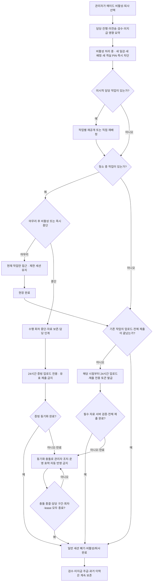

## 10. 권장 정보구조

### 관리자

```text
모바일 하단: 오늘 / 객실 / 메이드 / 더보기
상단 공통: 알림함

오늘
├─ 입실 시각 도달·미준비
├─ 시작 가능 시각 도달·미선점
├─ 마감 위험 청소
├─ 검수 대기
└─ 촛불·입실 차단 이슈

객실
├─ 일별 현황·객실별 기간 이력 (기본 오늘)
├─ 수동 예약
├─ 청소 일감 공개 대기·일괄 공개·진행
├─ 영향 확인·충돌 해결
├─ 특이사항·촛불
└─ 객실 PIN·이력

메이드
├─ 계정·근무 상태
├─ 비활성·퇴사 영향 확인·담당 인계
├─ 현재 담당·마감 위험
├─ 날짜·기간별 담당 및 실제 청소 이력
├─ 완료·반려·컴플레인
└─ 주급·지급 이력

더보기
├─ 객실·타입 매핑과 타입별 단가·예상시간
├─ 청소 템플릿·필수/선택 사진
├─ 계정·로그인 비밀번호 초기화
├─ 사진 보존 요청·개인정보 만료 상태
└─ 감사 이력
```

`객실` 탭은 오늘을 초기 날짜로 한 `일별 현황` 하나를 기본 화면으로 사용하며 별도 `전체 객실 상태` 화면을 만들지 않는다. `오늘`, `객실`, `메이드`의 목록은 데이터를 복제하지 않고 사건 종류에 맞는 정본 상세로 딥링크한다.

| 큐·알림 사건 | 정본 상세 |
|---|---|
| 예약·운영 중지·촛불·특이사항·입실/PIN 충돌 | 객실 상세 |
| 담당·수행·업로드·검수·재청소 | 청소 상세 |
| 메이드 계정·근무 상태·벌점 평가 | 메이드 상세 |
| 컴플레인 접수·판정·메이드 확인·이의 | 메이드 상세에서 여는 컴플레인 상세 |
| 주급 계산·지급 진행·정정 | 메이드 × 지급 주차 상세 |

`오늘`, 공개 일감, 내 업무, 검수, 알림함, 주급 등 모든 운영 큐는 화면 상태를 `불러오는 중 / 불러옴·0건 / 불러옴·데이터 있음 / 오래된 데이터·오류`로 구분한다. 불러오는 중에는 스켈레톤만 보여주고 `없음`으로 단정하지 않는다. 0건은 전체 0건과 현재 필터 결과 0건을 구분해 후자에는 `필터 초기화`를 제공한다. 오류·오프라인에서는 마지막 정상 동기화 시각과 재시도를 보여주고 캐시 카드가 있으면 `오래된 정보`로 읽기 전용 표시하되, 상태 변경·선점·PIN 조회·검수·지급은 최신 서버 재검증 전까지 잠근다. 재시도 성공 뒤 현재 상태와 권한을 다시 검증해 행동을 복원한다.

모바일 목록 카드는 객실·핵심 상태·마감과 현재 단계의 주 행동 1개만 노출한다. 관리자 주 행동은 `입실 차단 해결 → 검수 → 긴급 배정·공개 → 일감 생성 → 상세 보기`, 메이드는 `미전송 재시도 → 계속 청소 → 시작 → 선택 → 결과 보기` 순으로 결정하며 나머지 저위험 행동만 오버플로로 보낸다.

### 메이드

```text
모바일 하단: 공개 일감 / 내 업무 / 완료 / 주급 / 더보기
상단 공통: 알림함·미전송 사진 수

공개 일감 ─┐
내 업무 ───┼─> 하나의 청소 상세
완료·검수 ─┘
평가·컴플레인 ─> 컴플레인 상세
주급
더보기: 내 정보·알림 설정
```

메이드도 같은 청소 건을 탭마다 별도 화면으로 만들지 않는다. 목록은 상태별 진입점이고, 청소 상세 한 곳에서 시작·현장 완료·업로드 재시도·제출·반려 내용을 이어서 처리한다.

## 11. 통합 핵심 플로우

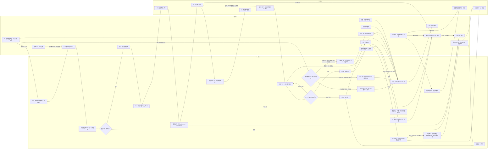

## 12. MVP 수용 기준

1. 객실 타입은 확정된 네 종류만 마스터 데이터로 사용한다.
2. 관리자는 청소 상태와 무관하게 예약 기간·예정 시각을 수동 등록할 수 있다.
   새 예약은 체크인 16:00·체크아웃 11:00을 기본 입력하고, 얼리 체크인·레이트 체크아웃은 최대 횟수 없이 1시간 단위로 조정하되 각 예약 날짜를 넘거나 입퇴실 순서가 뒤집히지 않게 한다.
3. 동일 객실 예약은 한국시간 `[체크인, 체크아웃)` 반개구간으로 비교해 같은 경계는 허용하고 1분이라도 겹치면 막는다. 객실별 DB 배타 제약 또는 직렬화 잠금으로 동시 삽입도 한 건만 성공시키고 충돌 기간을 보여준다.
4. 예약은 불변 입실 준비 의무를 참조하고 원 청소·최초 승인 전 재청소가 같은 의무를 공유한다. 현재 유효 시도 승인·촛불 0·운영 정상·차단 없음일 때만 준비 완료이며, 체크인 뒤 조건이 해소되면 유효 예약의 `예약상 투숙 중` 이벤트를 원자적으로 한 번 생성한다. 예약 추가·수정·취소 시 객실 일정 잠금 안에서 앞뒤 예약의 직전 점유·준비 의무 연결을 재계산한다.
5. 다음 예약이 없는 미청소 객실은 `일반 ASAP`로 표시하고 예약 관련 작업 뒤에 정렬한다.
6. 관리자는 청소 필요 객실을 공개 대기 묶음에 여러 개 모을 수 있다.
7. 공개 대기 작업에는 객실 타입의 고정 단가와 예상시간이 자동으로 입력되며 개별 작업 단가 수정은 제공하지 않는다. 타입 단가 변경은 이후 생성 작업에만 적용하고 기존 작업은 생성 당시 스냅샷을 유지한다.
8. 관리자가 일괄 공개한 묶음은 모든 메이드에게 같은 공개 시각에 나타나며, 유효하지 않은 작업이 하나라도 있으면 묶음 전체를 공개하지 않는다.
9. 공개 목록은 계획 서비스일·단가·시작 가능·마감·예상시간·우선순위 이유를 보여주고, 퇴실은 체크아웃→마감→다음 체크인, 연박은 요청 출입 범위→완료시각, 재청소는 시작 가능→다음 체크인·원 작업을 조건부 한 줄 일정으로 표시한다. 얼리·레이트 적용 시 기본 시각과의 시간 차이도 보여준다.
10. 메이드는 예정 체크아웃 전에도 공개 작업을 선택할 수 있지만 객실 PIN과 시작은 잠긴다.
11. 예정 체크아웃 시각이 되면 예약 점유가 자동 종료되고 담당 메이드의 객실 PIN과 청소 시작이 열린다.
12. 현장 벨 확인은 앱의 필수 입력이나 청소 시작 조건으로 만들지 않는다.
13. 긴급 작업은 관리자가 공개 묶음 밖에서 특정 메이드에게 직접 배정할 수 있다.
14. 작업당 활성 담당은 한 건이며 claim·관리자 직접 배정·취소 승인·재배정을 같은 `assignment_version` CAS로 처리한다. claim과 직접 배정 또는 취소와 시작이 동시에 오면 한 요청만 성공한다.
15. 한 메이드는 여러 작업을 선점할 수 있지만 모든 기기를 합쳐 활성 `청소 중` 수행 회차는 하나만 가능하도록 서버 유일 제약을 둔다.
16. 선점 작업 수를 강제 제한하지 않고 예상 소요시간상 완료가 어려울 때 메이드와 관리자에게 경고한다.
17. 메이드 취소 요청은 관리자 승인 전까지 담당 상태를 바꾸지 않는다.
18. 체크·사진·메모는 자동 임시저장되고 실패한 사진은 재전송할 수 있다.
19. 메이드는 이번 작업에서 새로 둔 촛불 개수를 제출한다.
20. 관리자는 촛불 전체 수량을 증감할 수 있고 1개 이상이면 고객 입실을 막는다.
21. 관리자 검수는 작업의 `current_submission_version_id`이면서 `SUBMITTED`인 제출 전체만 승인하거나 반려한다. 제출 버전당 결정 한 건과 조건부 전이로 동시 승인·반려 중 하나만 성공시키고, `SUPERSEDED` 버전은 수익·재청소·촛불·객실 상태를 바꾸지 못한다. 승인 또는 반려의 모든 부작용은 각각 한 트랜잭션으로 커밋한다.
22. 원 유상 청소 의무마다 불변 수익 자격을 하나 만들고 최초 승인 전 모든 반려·재작업·인계·제출 버전이 공유한다. 최신 유효 제출 승인 시 원 책임 메이드의 고정 단가 또는 대체 메이드 지정 금액 중 하나만 `UNIQUE(earning_entitlement_id)`로 원자 정산하며, 승인 후 다른 메이드 보상은 `UNIQUE(reclean_compensation_decision_id)`로 한 번만 만든다.
23. 검수 승인 후에도 현재 예약상 투숙 중이거나 촛불·운영 중지·입실 차단 이슈가 남으면 초록이 되지 않는다.
24. 재청소는 기존 메이드에게 기본 배정되고 관리자가 예외적으로 재공개할 수 있다.
25. 최초 승인 전 다른 메이드가 재청소를 인계하면 기존 메이드는 적립되지 않고 새 메이드에게 관리자 지정 재청소 금액만 최종 성공 완료일에 한 번 적립한다. 이미 승인된 청소의 컴플레인 재청소라면 기존 수익은 유지한다.
26. 수익 귀속일 기준으로 월~일 수익을 귀속하고 메이드·주 시작일별 유일 지급 레코드를 `OPEN`으로 둔다. 승인·지급 정정·상계와 지급 완료가 같은 행을 잠그며, 수익·정정 먼저면 지난주 대상에 포함하고 `PAID` 먼저면 고유 원천 ID의 다음 주 정정을 원자 생성한다.
27. 앱은 송금을 실행하지 않는다. 관리자가 외부 송금 전에 메이드별 지난주 전액을 `OPEN → PAYING` CAS로 선점해 금액·수익 ID·담당자를 잠그고, 송금 뒤 `PAYING → PAID`로 기록한다. `PAYING` 중 다른 지급을 막고 기록 실패는 `정산 확인 필요`로 유지하며, 송금하지 않았음을 확인한 사유가 있어야만 `OPEN`으로 복귀한다.
28. 컴플레인은 관련 청소·증빙을 연결해 `접수 → 확인 중 → 판정 → 메이드 확인/이의 → 종결`로 처리한다. 관리자만 판정·벌점·재청소를 정하고 메이드는 확인 또는 이의 메모를 남기며, 모든 정정은 새 이벤트로 보존한다. 벌점·컴플레인은 자동 종결하거나 주급에서 자동 차감하지 않는다.
29. 제출·승인·반려·취소 요청·마감 위험·지급·동기화 충돌·레이트 체크아웃 출입 충돌·컴플레인 판정과 이의 이벤트는 PWA 푸시와 앱 알림함에 모두 남긴다. 충돌 시 관리자는 발생·미처리를, 메이드는 업로드 검토 중 또는 일정 변경·관리자 확인 필요를 확인할 수 있다.
30. 관리자는 객실·PIN 버전에 대한 `PIN 변경 중` lease를 선점한 뒤 추천 또는 직접 입력한 4자리를 실제 도어락에 적용하고 한 번 저장한다. 저장 실패 시 불일치 상태로 입실·PIN 조회를 막고 실제 PIN 재입력 재시도 또는 도어락 원복 후 사유 있는 취소로만 종결한다.
31. 객실 PIN은 관리자 목록에서 마스킹되고 담당·출입 가능 메이드만 조회할 수 있다.
32. 모든 객실 PIN 조회는 사용자·시각·연결 작업을, 중요 상태 변경은 사용자·시각·필요 사유를 이력으로 남기되 PIN 원문은 기록하지 않는다.
33. 360px 이상 모바일과 데스크톱에서 가로 넘침 없이 동작한다.
34. 본문 14px 이상, 보조문구 12px 이상, 터치 영역 44×44px 이상을 적용한다.
35. 키보드와 스크린리더로 모달·폼·상태를 사용할 수 있다.
36. 예약 시각이 바뀌면 중복을 다시 검사하고 모든 미시작 연결 작업의 시작·마감·우선순위·PIN 공개를 같은 트랜잭션에서 재계산·알림한다. 자동 체크아웃 뒤 미래로 늦추면 점유 재개 보정과 미사용 권한·lease 폐기를 기록하고, PIN 조회 또는 청소 시작 뒤라면 빨강 출입 충돌로 격리해 현장 조율·PIN 교체·작업 재계획 전에는 정상 상태로 돌리지 않는다.
37. 관리자·메이드 계정은 이름을 표시 이름과 아이디로 사용하고, 동명이인은 이름1·이름2처럼 안정적인 번호로 구분한다.
38. 등록 휴대폰 번호 뒷 4자리를 최초·초기화 로그인 비밀번호로 사용하되 다음 로그인에서 개인 로그인 비밀번호 변경을 강제한다.
39. 여러 관리자 계정은 MVP에서 같은 권한을 가지며 검수·객실 타입 단가 설정·PIN·지급 행동의 수행자와 시각을 남긴다.
40. 시작 가능 시각이 지난 미선점 작업은 공개 상태를 유지하고 관리자에게 위험 알림을 보내며 관리자가 직접 배정할 수 있다.
41. 관리자는 네 객실 타입과 퇴실·연박·재청소 조합별 체크리스트·사진 템플릿을 수정할 수 있다.
42. 템플릿 변경은 새 버전을 만들고 작업 생성 시 버전을 고정해 기존 작업에 소급하지 않는다.
43. 관리자는 템플릿 사진을 필수와 선택으로 구분할 수 있다.
44. 필수 사진이 모두 업로드 완료되기 전에는 전체 청소 제출을 활성화하지 않는다.
45. 같은 휴대폰 전체 번호의 활성 계정이 있으면 신규 생성을 막고, 비활성·퇴사 계정이면 아이디와 과거 이력을 유지한 복구 흐름을 제공한다.
46. 동명이인 추가로 기존 아이디가 이름1로 바뀌어도 기존 계정의 로그인 비밀번호와 세션은 유지하고 로그인 전에도 변경 아이디를 전달한다.
47. 청소 템플릿 초안은 미리보기와 필수 항목 검증 후 게시해야 활성 버전이 되며, 조합별 활성 버전은 한 개다.
48. 템플릿은 기존 버전을 복제하거나 여러 객실 타입에 일괄 적용한 뒤 차이만 수정할 수 있다.
49. 통신 장애 중 체크·사진·메모를 기기에 내구 저장해 `현장 완료·업로드 대기`로 전환하면 청소 진행 슬롯은 해제되지만, 필수 사진이 서버에 도착하기 전에는 제출·검수를 막는다.
50. 상태별 큐는 예약·안전은 객실 상세, 담당·수행·검수는 청소 상세, 계정·평가는 메이드 상세, 컴플레인은 컴플레인 상세, 주급은 메이드×지급주차 상세로 연결한다. 모든 큐는 불러오는 중·진짜 0건/필터 0건·데이터 있음·오래된 데이터/오류를 구분하고, 오류 시 마지막 동기화·재시도를 표시하며 최신 서버 재검증 전 상태 변경·PIN·검수·지급을 막는다. 모바일 카드는 주 행동 하나만 노출하고 관리자 우선순위는 입실 차단 해결→검수→긴급 배정·공개→일감 생성→상세, 메이드는 미전송 재시도→계속→시작→선택→결과다.
51. 동명이인 변경 전 아이디는 같은 불변 사용자 ID를 가리키는 임시 별칭이며, 새 아이디 최초 성공 로그인과 동시에 원자적으로 폐기한다. 담당·평가·주급 데이터는 별칭에 생성하지 않는다.
52. 개인 로그인 비밀번호는 선행 0을 허용하는 숫자 6자리 이상으로 하고, 사용자 단위 연속 5회 실패 시 서버 시각 기준 15분 고정 잠금을 적용한다. 객실 4자리 PIN과 명칭·저장·권한을 분리한다.
53. 필수·선택 사진 모두 카메라와 갤러리·파일 선택을 허용하고 여러 장을 한 번에 올릴 수 있다. 갤러리 여부나 EXIF 시각은 제출 차단·현장 완료일·수익 귀속일의 근거로 사용하지 않는다.
54. 제출 활성화 뒤 메이드가 전체 제출해야 하며, 필수 파일의 업로드·형식·크기·해시·소유권·담당 버전 서버 검증을 통과한 뒤에만 검수 대기로 전환한다. 제출 후 새 버전을 만들 때 이전 검수 대기 버전을 `SUPERSEDED`로 바꾸고 현재 포인터를 원자 전환하며, 실패는 교체·재전송하고 담당 충돌은 격리한다.
55. 오프라인 현장 완료는 객실 초록·검수·수익을 발생시키지 않는다. 현재 작업 lease의 이벤트를 순서대로 원자 재생하고 같은 제출 UUID는 한 건만 만든다. 충돌은 기록만 수용·운영 효력 기각·정정 연결 중 하나로 종결하되 현재 상태·담당·수익을 자동 변경하지 않는다.
56. 관리자 `오늘`은 실시간 큐로 고정하고 `객실 > 일별 현황`에서 이전·오늘·다음·날짜 직접 선택으로 모든 객실을 조회한다.
57. 과거 날짜는 읽기 전용 일마감 상태와 당일 상태 전이 타임라인을 함께, 오늘은 실시간 상태를, 미래는 예약·청소·담당 계획만 `예정`으로 보여준다.
58. 객실 일별 현황과 메이드 당일 담당·수행 이력을 각각 제공하고, 두 상세의 기간 이력은 7일·30일·직접 선택과 객실·타입·청소 유형·담당·실제 수행자·재배정·재청소·검수 결과 필터를 제공하며 복귀 시 날짜·필터·스크롤을 복원한다.
59. 예정·현재 담당, 담당 구간, 실제 시작자·완료자, 제출자, 검수자, 수익 귀속자를 분리해 저장하고 재배정·재청소가 이전 수행 회차를 덮어쓰지 않게 한다.
60. 운영 이벤트는 불변 사용자 ID·당시 표시명·효력 시각·서버 기록 시각·전후 값·사유를 보존하고, 과거 정정은 원본 삭제가 아니라 연결된 정정 이벤트로 남긴다.
61. 계획 서비스일, 현장 완료·서버 수신 시각, 수익 귀속일을 분리하고 늦은 업로드·검수로 이미 확정한 지급 주가 바뀌지 않게 한다.
62. 청소 작업 한 건의 책임 메이드는 한 시점에 한 명이며 시작·현장 완료 actor는 현재 담당 버전과 일치해야 한다. 정상 현장 완료 후에는 그때 동결된 미중단 담당 버전의 책임 메이드만 제출할 수 있고, 중단·인계된 이전 메이드 자료는 증빙·충돌 이력일 뿐 유효 제출이 아니다. 공동 담당·대신 제출·단가 분할·공동 적립은 제공하지 않는다.
63. 최초 검수 반려 후 재청소한 건의 수익 귀속일은 최종 승인된 수행 회차의 현장 완료일로 고정한다. 승인 후 컴플레인 재청소는 원 수익의 귀속일을 바꾸지 않는다.
64. 새 아이디 최초 성공 로그인 시 사용자 단위 실패 횟수와 `locked_until`을 초기화하고 현재 기기만 유지하며 기존 아이디의 다른 세션을 폐기한다. 관리자 로그인 비밀번호 초기화도 실패 횟수·15분 잠금·기존 세션을 함께 초기화한다.
65. 운영·담당·검수·정산 메타데이터는 계속 보존하되 고객 이름·휴대폰 원문·인증정보는 별도 만료정책을 따른다. 사진 삭제 후에도 파일 해시·업로드·검수·삭제 이력은 남긴다.
66. 완전 오프라인에서는 온라인으로 이미 시작하고 불변 사용자 ID·한 기기·현재 작업·담당 버전·만료에 묶인 서버 서명 lease의 작업만 이어서 완료할 수 있다. PIN은 lease에 저장하지 않으며 다음 작업은 온라인 담당·시각 검증과 새 PIN 조회 전까지 시작할 수 없다. 사용자당 활성·미만료 lease는 모든 기기를 합쳐 하나다.
67. 푸시는 보조 수단이며 서버 상태·앱 알림함·관리자 오늘 큐를 정본으로 사용한다. 푸시 거부·실패로 일감을 자동 해제하지 않고 위험 상태는 해결될 때까지 남긴다.
68. 객실 PIN은 분리된 키로 서버 암호화 저장하고 권한 조회 응답을 캐시하지 않으며 브라우저 영속 저장·서비스워커·오프라인 큐·로그에 원문을 두지 않는다. 조회 30초, 화면 이동, 앱 백그라운드, 기기 잠금, 담당 해제 시 화면 메모리까지 지우고 다시 마스킹하며 알림·목록·클립보드에 노출하지 않는다.
69. 과거 운영이력은 직접 수정·삭제할 수 없고 관리자 정정 이벤트로만 변경한다. 원값·새 값·효력 시각·사유·영향을 보존한다.
70. 마지막 활성 관리자 계정은 비활성·퇴사·역할 변경할 수 없다.
71. 담당 취소 승인 시 시작 전에는 담당 구간만 종료하고, 진행 중에는 수행 회차를 중단으로 종료해 체크·사진·사유를 보존한 뒤 관리자가 재공개·직접 배정·보류를 선택한다. 현장 완료 후에는 담당 취소를 제공하지 않는다.
72. 수행 회차·미디어 동기화·제출/검수 상태를 별도 축으로 저장하고 필수 자료의 서버 검증 완료 후에만 제출됨·검수 대기로 전환한다.
73. 예정 체크인·체크아웃과 체크인 후 지연 준비 완료 전이는 실행 시점의 서버 이벤트로 한 번 기록하며 이후 예약 수정이 과거 전이를 덮어쓰지 않는다. 자동 체크아웃 뒤 연장에는 연결된 점유 재개 보정 이벤트를 추가한다.
74. 다음 체크인이 있는 퇴실·재청소는 네 객실 타입 모두 체크인 30분 전을 준비 마감으로 사용하고, 다음 체크인이 없으면 일반 ASAP를 사용한다. 연박 청소는 관리자가 유효 예약 안의 계획일·출입 허용 범위·요청 완료 시각을 입력해 비공개 작업으로 만들며 `시작 < 완료 ≤ 종료`를 검증하고, 공개 뒤 담당 메이드에게 같은 일정과 고정 타입 단가를 보여준다. 연박 작업은 예약 점유를 종료하거나 다음 예약의 입실 준비 승인으로 사용하지 않는다.
75. 수동 예약 저장 시 예정 체크아웃에 연결된 비공개 퇴실 청소 초안을 예약당 하나만 자동 생성한다. 시각 변경·투숙 전 취소는 비공개 초안에 반영하고, 공개·선점 미시작 작업의 시각 변경은 일정 재계산·담당 알림으로 처리한다. 공개·선점 뒤 예약 취소와 진행·출입 공개 뒤 변경은 관리자 영향 확인 없이 되돌리지 않는다.
76. 운영일과 수익 귀속일은 한국시간 자정 기준이며 자정을 넘긴 작업은 최종 성공 현장 완료일에 귀속한다. 오프라인 경계 충돌은 관리자 확인 전까지 귀속을 보류한다.
77. 메이드 비활성·퇴사 전 영향을 보여주고 `비활성 처리 중`부터 새 일감·새 객실 PIN을 차단한다. 미시작은 관리자 재공개·재배정, 진행 중은 제한 세션으로 마무리하거나 중단·인계하며 일반 세션은 최종 `비활성·퇴사 완료` 때 폐기한다.
78. 정상 현장 완료·미제출 작업은 전용 토큰 발급부터 24시간 동안 동결 담당 버전으로 업로드·검증·전체 제출을 허용한다. 즉시 중단·인계된 이전 메이드는 증빙 업로드만 가능하고 유효 제출·검수·수익 연결은 금지한다. 만료 후 자동 승인하지 않으며 검수·정산·과거 이력은 보존한다.
79. 담당 취소 요청은 모든 관리자에게 즉시 표시하고 15분 미처리 또는 남은 여유 60분 미만이면 빨강 재알림하되 자동 취소·자동 재공개하지 않는다.
80. 고객 이름은 운영 이벤트와 분리된 예약 개인정보 필드로 관리자 상세에만 표시하고 체크아웃 또는 투숙 전 취소 후 180일에 삭제한다. 공유 자유입력에는 고객 개인정보 입력 금지를 안내하고 전화번호·이메일 패턴을 경고·마스킹하며, 과거 운영이력은 예약 ID와 가림 문구만 유지하고 `익명 고객`으로 표시한다.
81. 휴대폰 원문은 운영·감사 이벤트에 기록하지 않으며, 퇴사 180일 후 계정 개인정보 저장소·검색 인덱스·캐시에서 삭제하고 중복·재입사 비교용 비가역 해시만 남긴다.
82. 청소 사진은 각 제출 승인·반려 후 180일, 특이사항·컴플레인 사진은 해결 후 180일, 중단·동기화 충돌 증빙은 관리자 종결 후 180일, 진짜 고아 업로드는 30일 보존한다. 만료 시 원본·썸네일·파생본·캐시를 삭제하고 보존 요청 기간에는 남은 기간 계산을 멈춘다.

## 13. 권장 구현 순서

### 0단계 — 운영 데이터 확정

- 실제 객실 번호와 네 객실 타입 매핑
- 타입별 기본 청소 단가·예상시간
- 객실 타입 × 퇴실·연박·재청소별 체크리스트·필수/선택 사진
- 자주 쓰는 특이사항 유형
- 관리자·메이드 계정과 초기 권한

위 항목은 제품정책 미확정이 아니라 구현 전에 대표가 추후 입력하기로 한 운영 초기 데이터다. 값이 들어오기 전에는 실제 일감 공개·주급 계산을 운영 환경에서 시작하지 않는다.

### 1단계 — 안전한 기반

- 인증·세션·관리자/메이드 권한
- 이름 아이디·동명이인 번호·휴대폰 중복 차단·비활성 계정 복구
- 불변 사용자 ID·임시 로그인 별칭·휴대폰 뒷 4자리 최초 로그인 비밀번호
- 숫자 6자리 이상 개인 로그인 비밀번호·5회 실패 15분 잠금
- 최초 로그인 개인 로그인 비밀번호 변경·관리자 초기화·세션 폐기
- 복수 관리자 동일 권한과 중요 행동 감사 로그
- 서버 데이터베이스 상태 원장·운영 도메인 이벤트·분리된 감사 로그
- 고객 이름·퇴사자 연락처 익명화와 비가역 중복 비교 해시
- 객실·예약 기간·특이사항·촛불 모델
- 객실 상태 파생 함수와 빨강·주황·초록·중립색 표시

### 2단계 — 객실 운영과 공개 일감

- 관리자 오늘 큐와 전체 객실판
- 객실 일별 현황·과거 일마감/타임라인·미래 예정·기간 이력
- 반개구간·객실별 중복 배타 제약을 적용한 수동 예약과 예약별 입실 준비 청소 연결
- 체크인 지연 준비 완료 전이·체크아웃 후 연장 보정·PIN 공개 충돌 처리
- 예약 저장 시 퇴실 청소 비공개 초안 자동 생성·단계별 변경·취소 영향 처리
- 공개 대기 묶음·타입별 단가 자동 입력·일괄 공개
- 예정 체크아웃 자동 종료·청소 출입 자동 개방
- 활성 담당·메이드 진행 회차 유일 제약과 assignment version CAS 기반 선착순·직접 배정·취소·재배정
- 담당 취소 15분·남은 여유 60분 단계 상승과 메이드 비활성·퇴사 인계
- 시작 가능 시각 도달 미선점 알림·공개 유지

### 3단계 — 메이드 PWA

- 공개 일감·내 업무·한 작업 진행 제한
- 객실 PIN 제한 공개
- 초안·게시·활성 버전형 청소 템플릿·복제·일괄 적용
- 카메라·갤러리 다중 사진·오프라인 현재 작업 내구 저장·현장 완료 업로드 대기·멱등 재전송
- 완전 오프라인 다음 작업·새 PIN 차단과 사용자당 단일 현재 작업 lease
- 비활성·퇴사 정상 완료 건 24시간 제출·중단 건 증빙 업로드 제한 권한
- 필수/선택 사진과 필수 사진 제출 게이트
- 청소·이슈 사진 180일, 고아 파일 30일, 파생본·캐시 삭제와 보존 일시정지
- 특이사항·촛불 제출

### 4단계 — 검수·알림·주급

- 제출 버전당 단일 결정 제약을 적용한 청소 전체 승인·반려·재청소
- PWA 푸시와 알림함
- 승인 수익 원장
- 담당 구간·청소 수행 회차·제출·검수·수익 귀속 연결 이력
- 메이드·주차별 유일 지급 레코드와 승인·지급 직렬화, 외부 전액 지급 후 완료 기록·정정 이월
- 컴플레인·평가

### 후속 단계

- PMS/OTA·CSV 연동
- 도어락 API 연동
- 동선 기반 추천과 자동 배정 보조
- 반복 컴플레인·마감 위험 통계

현재 모놀리스 HTML을 기능별로 확장하지 않고, 위 순서로 새 애플리케이션을 만드는 편이 안전하다. 기존 시안에서는 색상·카드 구성·일감 확인 모달처럼 검증된 시각 요소만 선택적으로 참고한다.

## 14. 근거 위치

- 실제 마감 정렬이 아닌 색상 정렬: `CURRENT/index.html:1586`, `CURRENT/index.html:1607`
- 잘못된 `지금 입실 가능` 용어: `CURRENT/index.html:1592`, `CURRENT/index.html:1616`
- 관리자 목록 객실 PIN 평문: `CURRENT/index.html:1407`
- 메이드 객실 PIN 전역 토글: `CURRENT/index.html:1651`, `CURRENT/index.html:2921`
- 알림 자리표시자: `CURRENT/index.html:2408`
- 사진별 확인 강제: `CURRENT/index.html:1693-1711`, `CURRENT/index.html:2976-2982`
- 색상을 원본 상태처럼 저장: `CURRENT/index.html:845-857`
- 문서의 파생 색상 원칙: `DOCS/03_STATE_MODEL_AND_BUSINESS_RULES.md:16`
- 현재 객실 타입: `CURRENT/index.html:845-857`
- 608호 전용 규칙: `DOCS/03_STATE_MODEL_AND_BUSINESS_RULES.md:87`, `DOCS/04_WORKFLOWS_AND_FLOWCHARTS.md:26`
- 서버·DB·동시성 미검증: `DOCS/13_QA_REPORT.md:45-52`
